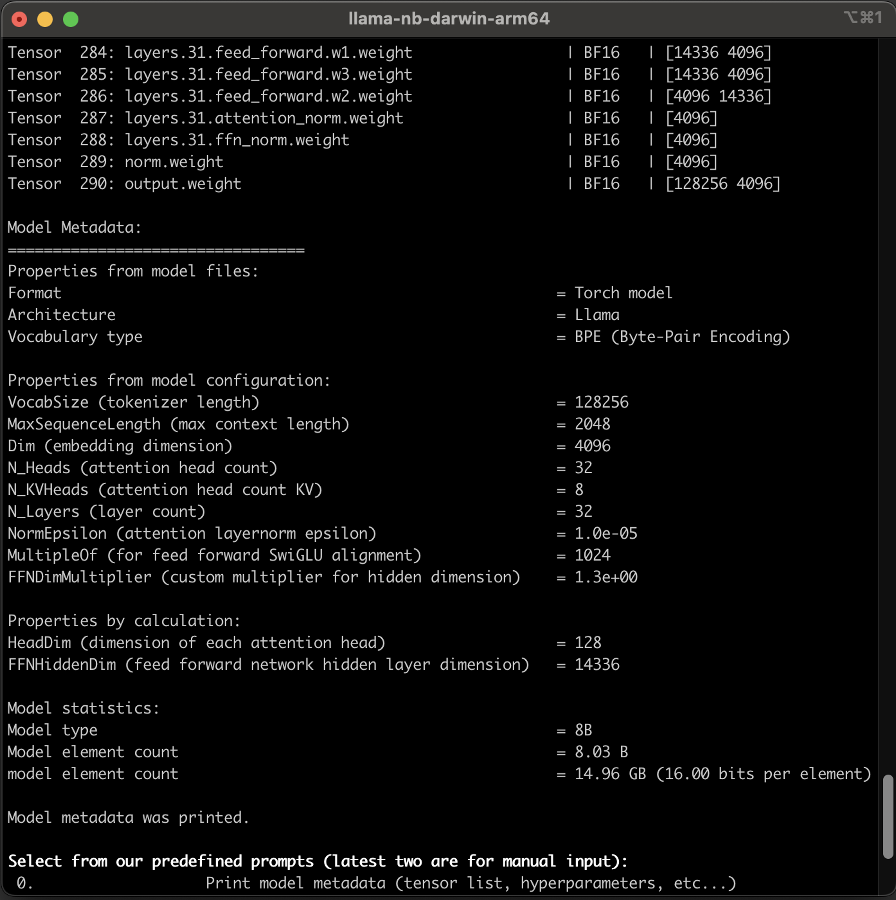

# </img> **Llama 3.1 Nuts and Bolts**

[](https://www.linkedin.com/in/alper-dalkiran/)
[](https://twitter.com/aalperdalkiran)


A holistic way of understanding how Llama and its components run in practice, with code and detailed documentation ([GitHub Pages](https://adalkiran.github.io/llama-nuts-and-bolts/) | [GitHub](./docs/)). "The nuts and bolts" (practical side instead of theoretical facts, pure implementation details) of required components, infrastructure, and mathematical operations without using external dependencies or libraries.


This project intentionally **<u>doesn't have</u>** support for [GPGPU](https://en.wikipedia.org/wiki/General-purpose_computing_on_graphics_processing_units) (such as [nVidia CUDA](https://tr.wikipedia.org/wiki/CUDA), [OpenCL](https://tr.wikipedia.org/wiki/OpenCL)) as well as [SIMD](https://en.wikipedia.org/wiki/Single_instruction,_multiple_data) because it doesn't aim to be a production application, for now. Instead, the project relies on CPU cores to perform all mathematical operations, including linear algebraic computations. To increase performance, the code has been optimized as much as necessary, utilizing parallelization via [goroutines](https://gobyexample.com/goroutines).

<br>
<sup>*Llama Nuts and Bolts Screen Recording GIF, captured while the application was running on the Apple MacBook Pro M1 Chip. Predefined prompts within the application were executed. The GIF is 20x faster.*</sup>

## :thought_balloon: **WHY THIS PROJECT?**

This project was developed for only educational purposes, and has not been tested for production or commercial usage. The goal is to make an experimental project that can perform inference on the Llama 3.1 8B-Instruct model completely outside of the Python ecosystem. Throughout this journey, the aim is to acquire knowledge and shed light on the abstracted internal layers of this technology.

This journey is an intentional journey of literally *reinventing the wheel*. While reading this journey in the documentation directory ([GitHub Pages](https://adalkiran.github.io/llama-nuts-and-bolts/) | [GitHub](./docs/)), you will navigate toward the target with a deductive flow. You will encounter the same stops and obstacles I encountered during this journey.

If you are curious like me about how the LLMs (Large Language Models) and transformers work and have delved into conceptual explanations and schematic drawings in the sources but hunger for deeper understanding, then this project is perfect for you too!

## :blue_book: **DOCUMENTATION**

The journey can be found documented step by step at [Llama Nuts and Bolts - GitHub Pages](https://adalkiran.github.io/llama-nuts-and-bolts/) website with a visually better experience, or at [docs directory](./docs/).

## :dart: **COVERAGE**

Due to any of the existing libraries (except the built-in packages and a few helpers) wasn't used, all of the required functions were implemented by this project in the style of Go. However, the main goal of this project is to do inference only on the Llama 3.1 8B-Instruct model, the functionality fulfills only the requirements of this specific model. Not much, not less, because the goal of our project is not to be a production-level tensor framework.

The project provides a CLI (command line interface) application allowing users to choose from predefined prompts or write custom prompts. It then performs inference on the model and displays the generated text on the console. The application supports "streaming," enabling immediate display of generated tokens on the screen without waiting for the entire process to complete.

As you can see in the chapters in the documentation directory ([GitHub Pages](https://adalkiran.github.io/llama-nuts-and-bolts/) | [GitHub](./docs/)), covered things are:

* All diagrams about the model and the flow are listed in [Chapter 20](https://adalkiran.github.io/llama-nuts-and-bolts/20-DIAGRAMS/),
* Parallelization and concurrency in Go, see [Chapter 13](https://adalkiran.github.io/llama-nuts-and-bolts/13-GENERATING-NEXT-TOKENS/),
* Implementing [Memory Mapping](https://en.wikipedia.org/wiki/Memory-mapped_file) that allows us to map a large file content to memory address space in Go for both Linux/MacOS and Windows platforms, see [Chapter 2](https://adalkiran.github.io/llama-nuts-and-bolts/02-LOADING-TORCH-MODEL/),
* Implementing [BFloat16 (Brain Floating Point)](https://en.wikipedia.org/wiki/Bfloat16_floating-point_format) data type which isn't supported by the Go language, from scratch, see [Chapter 7](https://adalkiran.github.io/llama-nuts-and-bolts/07-BFLOAT16-DATA-TYPE/),
* Implementing support for "streaming" output via [Go channels](https://go101.org/article/channel.html), see [Chapter 13](https://adalkiran.github.io/llama-nuts-and-bolts/13-GENERATING-NEXT-TOKENS/),
* Loading a [PyTorch](https://pytorch.org/) model weights file ("consolidated.00.pth") which was saved as [Pickle (.pkl)](https://github.com/python/cpython/blob/main/Lib/pickle.py) format, from scratch, see [Chapter 2](https://adalkiran.github.io/llama-nuts-and-bolts/02-LOADING-TORCH-MODEL/) and [Chapter 3](https://adalkiran.github.io/llama-nuts-and-bolts/03-LOADING-TORCH-MODEL-DETAILS/),
* Loading the model arguments JSON file ("params.json"), see [Chapter 4](https://adalkiran.github.io/llama-nuts-and-bolts/04-LOADING-MODEL-ARGS/),
* Loading a [Byte-Pair Encoding (BPE)](https://huggingface.co/learn/nlp-course/en/chapter6/5) tokenizer model which was saved as [Tiktoken tokenizer format](https://github.com/openai/tiktoken) file ("tokenizer.model"), from scratch, see [Chapter 5](https://adalkiran.github.io/llama-nuts-and-bolts/05-LOADING-TOKENIZER-MODEL/),
* Implementing a [Tensor](https://en.wikipedia.org/wiki/Tensor_%28machine_learning%29) type, tensor aritmetic and machine learning mathematical operation functions, see [Chapter 8](https://adalkiran.github.io/llama-nuts-and-bolts/08-TENSOR/),
* Working with  [C contiguous](https://stackoverflow.com/questions/26998223/what-is-the-difference-between-contiguous-and-non-contiguous-arrays) arrays in multi-dimensional form, see [Chapter 8](https://adalkiran.github.io/llama-nuts-and-bolts/08-TENSOR/),
* Building the blocks of Llama 3 model architecture, see [Chapter 9](https://adalkiran.github.io/llama-nuts-and-bolts/09-IMPLEMENTING-LLAMA-MODEL-ARCHITECTURE/),
* Implementing [RoPE \(Rotary Positional Embeddings\)](https://arxiv.org/abs/2104.09864v5) and precomputing frequency tensor, see [Chapter 10](https://adalkiran.github.io/llama-nuts-and-bolts/10-ROPE-ROTARY-POSITIONAL-EMBEDDINGS/) and [Chapter 10.BONUS](./docs/10.BONUS-PRECOMPUTING-FREQUENCY-TENSOR.ipynb),
* Understanding tokens, vocabulary, and tokenization, see [Chapter 12](https://adalkiran.github.io/llama-nuts-and-bolts/12-TOKENIZATION/),
* Generating the next token, internals of transformer block, being an auto-regressive model, multi-head self-attention, and much more, see [Chapter 13](https://adalkiran.github.io/llama-nuts-and-bolts/13-GENERATING-NEXT-TOKENS/), [Chapter 14](https://adalkiran.github.io/llama-nuts-and-bolts/14-MAKING-PREDICTION-WITH-LLAMA-MODEL-1/), [Chapter 15](https://adalkiran.github.io/llama-nuts-and-bolts/15-MAKING-PREDICTION-WITH-LLAMA-MODEL-2/), [Chapter 16](https://adalkiran.github.io/llama-nuts-and-bolts/16-MAKING-PREDICTION-WITH-LLAMA-MODEL-3/),
* Understanding internals of the [Unicode Standard](https://en.wikipedia.org/wiki/Unicode), [UTF-8](https://en.wikipedia.org/wiki/UTF-8) encoding, and how emojis are represented and rendered, see [Chapter 17](https://adalkiran.github.io/llama-nuts-and-bolts/17-UNICODE-UTF-8-EMOJIS/),
* And, so much more!

## :triangular_ruler: **MODEL DIAGRAM**

This diagram has extensive and comprehensive content and tries to reveal all of the details as much as possible. These reasons made it to have a considerable length. To use the space here efficiently, it was enclosed within an expandable section as follows:

<details>
  <summary><b>Click to expand to see the Complete Model Diagram</b></summary>

<br>
The whole flow of Llama 3.1 8B-Instruct model without abstraction:<br><br>


</details>

## :package: **INSTALLATION and BUILDING**

### Downloading the Official Model Files

Llama model weights files can be found in several formats on the Internet. Meta's official format, HuggingFace format, GGUF format, etc... But our project uses only the official format.

>Note: [Download chapter of original Llama 3.1 package repository](https://github.com/meta-llama/llama-models?tab=readme-ov-file#download) and this [How to Install Llama 2 Locally](https://medium.com/@tushitdavergtu/how-to-install-llama-2-locally-d3e3c6c8eb4c) article (disclaimer: there are some differences between this article and Llama 3.1) may help you too.

<details>
  <summary><b>Click to expand the details of downloading instructions</b></summary>

* Request access from Meta Website [https://llama.meta.com/llama-downloads/](https://llama.meta.com/llama-downloads/) by filling the form. The email address must be valid and it's enough to mark "Llama 3.1" checkbox in the model list,
* You will receive an email from Meta including the instructions for downloading the files,
* Download the [download.sh](https://github.com/meta-llama/llama-models/blob/main/models/llama3_1/download.sh) file from the official Llama repository,
* Create a parent directory, and copy the ```download.sh``` script there:

    ```sh
    $ mkdir llama-models
    $ cd llama-models
    ```

* Give executable permission to the download.sh file:

    ```sh
    llama-models$ chmod +x download.sh
    ```

* Pre-requisites: Make sure you have ```wget``` and ```md5sum``` installed,
* Run the script:

    ```sh
    llama-models$ ./download.sh
    ```

* The download script asks for the URL was come with the email:

    ```sh
    llama-models$ ./download.sh
    Enter the URL from email:
    ```

* Copy the URL written after ```When asked for your unique custom URL, please insert the following``` text in the email, and press ENTER,
* It asks for the model names that you want to download:

    ```sh
    llama-models$ ./download.sh
    Enter the URL from email: # URL was entered and ENTER was pressed

    **** Model list ***
    -  meta-llama-3.1-405b
    -  meta-llama-3.1-70b
    -  meta-llama-3.1-8b
    -  meta-llama-guard-3-8b
    -  prompt-guard
    Choose the model to download:
    ```

* Write ```meta-llama-3.1-8b``` and press ENTER, be careful on writing as it is because it is case-sensitive,

* It asks for the sub-model name:

    ```sh
    Choose the model to download: meta-llama-3.1-8b

    Selected model: meta-llama-3.1-8b

    **** Available models to download: ***
    -  meta-llama-3.1-8b-instruct
    -  meta-llama-3.1-8b
    Enter the list of models to download without spaces or press Enter for all:
    ```

* Write ```meta-llama-3.1-8b-instruct``` and press ENTER, be careful on writing as it is because it is case-sensitive,

* If everyting goes well, you will see a progress like:

    ```sh
    ...
    Enter the list of models to download without spaces or press Enter for all: meta-llama-3.1-8b-instruct
    Downloading LICENSE and Acceptable Usage Policy
    ...
    ```

* If you get HTTP 403 error:
    * Check if you wrote the model name correctly as ```meta-llama-3.1-8b``` and then ```meta-llama-3.1-8b-instruct```
    * Check if the download link you copied ends with ```Select``` text, it shouldn't contain it, as described in the [llama 2 github issue](https://github.com/facebookresearch/llama/issues/351#issuecomment-1641012729)

* If you did everything correct, wait for the progress finishes. It will download ~16GB of files.

</details>

* If you have issues with downloading process, check out the links above and click on the collapsible paragraph above to expand.

* If everyting went well, you will have a directory (in our example it's named ```llama-models```)

    ```sh
    llama-models (parent directory)
    |-download.sh
    |-LICENSE
    |-USE_POLICY.md
    |-Meta-Llama-3.1-8B-Instruct
    |  |-consolidated.00.pth # our model weights file
    |  |-params.json # our model arguments file
    |  |-tokenizer.model # our tokenizer model file
    ```

### Cloning the repository and maintaining proper directory structure

* Clone this repo and enter into this directory,
* You will see the empty directory named ```models-original```,

    ```sh
    llama-nuts-and-bolts (parent directory)
    |-...
    |-models-original
    |  |-.gitkeep
    |-...
    ```

* Move the directory named ```llama-models/Meta-Llama-3.1-8B-Instruct``` into ```llama-nuts-and-bolts/models-original/``` directory (case sensitive).

* You should have the following directory structure:

    ```sh
    llama-nuts-and-bolts (parent directory)
    |-...
    |-models-original
    |  |-Meta-Llama-3.1-8B-Instruct
    |  |  |-consolidated.00.pth
    |  |  |-tokenizer.model
    |  |  |-params.json
    |  |-.gitkeep
    |-...
    ```

### Production Mode - Native Environment

Alongide you can run this project in a dockerized or virtualized environment, it's more suggested that to run this project without virtualization. You will see the performance difference between them.

The most performant option is to build the project and to run the executable.

You can build the project for your system's operating system, the executable will be named as ```llama-nb```:

```sh
# For Linux/MacOS, use:
$ go build -o llama-nb cmd/main.go
# For Windows, use:
$ go build -o llama-nb.exe cmd/main.go
```

Or, you can build the project for every supported platforms into the ```./output``` directory (you can check out the contents of the [scripts/build.sh](./scripts/build.sh) file). It will build the project for darwin (MacOS), linux, and windows platforms, 386, amd64 (Intel x64), and arm64 (64 bit ARM architecture including Apple Silicon M1/M2/M3).

```sh
$ cd llama-nuts-and-bolts
$ ./scripts/build.sh
# Check out the "output" directory in the project directory
```

Or, you can run the project via:

```sh
$ cd llama-nuts-and-bolts
$ go run cmd/main.go
```

### Production Mode - Dockerized Environment

On Linux or WSL2 on Windows, you can use [./docker-compose.yml](./docker-compose.yml) as

```sh
$ docker-compose up -d
```

This command initiates a container named ```llama-nuts-and-bolts-cli-1``` in daemon mode in idle mode.

You can run the project via:

```sh
$ docker exec -it llama-nuts-and-bolts-cli-1 go run cmd/main.go
```

Or, you can build the project for Linux (the container's OS), the executable will be named as ```llama-nb```:

```sh
$ docker exec -it llama-nuts-and-bolts-cli-1 go build -o llama-nb cmd/main.go
```

Or, you can build the project for every supported platforms into the ```./output``` directory (you can check out the contents of the [scripts/build.sh](./scripts/build.sh) file). It will build the project for darwin (MacOS), linux, and windows platforms, 386, amd64 (Intel x64), and arm64 (64 bit ARM architecture including Apple Silicon M1/M2/M3).

```sh
$ docker exec -it llama-nuts-and-bolts-cli-1 ./scripts/build.sh
# Check out the "output" directory in the project directory
```

### Production Mode - Dockerized Environment / Without WSL2

Docker Desktop on Windows supports two modes: WSL 2 Mode (Windows Subsystem for Linux) and Windows virtualization mode. If you want to run second, you can use the [docker/windows-amd64/Dockerfile](./docker/windows-amd64/Dockerfile) and the [docker/windows-amd64/docker-compose.yml](./docker/windows-amd64/docker-compose.yml).

### Development Mode - Dockerized Environment

You can use [./docker-compose.yml](./docker-compose.yml) with Docker Compose and create a development environment in the container via VSCode. For more information, you can check out my other project *WebRTC Nuts and Bolts*'s Readme chapter: [Development Mode: VS Code Remote - Containers](https://github.com/adalkiran/webrtc-nuts-and-bolts/blob/main/README.md#development-mode-vs-code-remote---containers).

>I've been using VS Code Remote Containers while developing this project and most of my other projects.

## :computer: **RUNNING**

Run the project with executing ```go run ...``` command or executing the compiled executable. It's more suggested that to run this project's executable after building it, and without virtualization for higher performance.

When you run the project, you will see the following screen. It prints the summary of the loading process of model files and a summary of model details.


### Printing Model Metadata

If you select the first item in the menu by pressing 0 key and ENTER, the application prints the metadata of Llama 3.1 8B-Instruct model on the console:




### Executing a Prompt

Alongside you can select one of predefined prompts in the menu, you can select one of latest two items (```Other, manual input```) to input your custom prompts.

With the ```[Text completion]``` choices, the model is used only to perform text completion task. New tokens will be generated according to the input prompt text.

With the ```[Chat mode]``` choices, the application starts the prompt with ```""<|begin_of_text|>"``` string to specify "this is an instruction prompt". Also it surrounds the system prompt part with ```<|start_header_id|>system<|end_header_id|>\n``` and ```<|eot_id|>``` strings to specify this part is a *system prompt*, surrounds the user prompt part with ```<|start_header_id|>user<|end_header_id|>\n``` and ```<|eot_id|>``` strings to specify this part is a *user prompt*.

At the end, a chat mode prompt string will be look like following:

```sh
"<|begin_of_text|><|start_header_id|>system<|end_header_id|>

Always answer with emojis<|eot_id|><|start_header_id|>user<|end_header_id|>

How to go from Beijing to NY?<|eot_id|><|start_header_id|>assistant<|end_header_id|>

"
```

And the output of this prompt is like the following (consists of emojis with their names and unicode escape sequences):


## :bricks: **ASSUMPTIONS**

The full-compliant, generic, production-ready, and battle-tested tensor frameworks should have support for a wide range of platforms, acceleration devices/processors/platforms, use cases, and lots of convertibility between data types, etc.

In **Llama Nuts and Bolts** scenario, some assumptions have been made to focus only on required set of details.

| Full-compliant applications/frameworks | Llama Nuts and Bolts |
|---|---|
| Use existing robust libraries to read/write file formats, perform calculations, etc. | This project aims to *reinvent the wheel*, so it doesn't use any existing library. It implements everything it requires, precisely as much as necessary. |
| Should support a wide range of different data types and perform calculations between different typed tensors in an optimized and performant way. | Has a limited elasticity for only required operations. |
| Should support a wide range of different file formats. | Has a limited support for only required file formats with only required instructions. |
| Should support *top-k*, *top-p*, and, *temperature* concepts of the LLMs (Large Language Models) to randomize the outputs, explained [here](https://ivibudh.medium.com/a-guide-to-controlling-llm-model-output-exploring-top-k-top-p-and-temperature-parameters-ed6a31313910). | This project doesn't have support for randomized outputs intentionally, just gives the outputs that have the highest probability. |
| Should support different acceleration technologies such as [nVidia CUDA](https://tr.wikipedia.org/wiki/CUDA), [OpenCL](https://tr.wikipedia.org/wiki/OpenCL), [Metal Framework](https://developer.apple.com/documentation/metal), [AVX2 instructions](https://en.wikipedia.org/wiki/Advanced_Vector_Extensions), and [ARM Neon instructions](https://developer.arm.com/Architectures/Neon), that enable us [GPGPU](https://en.wikipedia.org/wiki/General-purpose_computing_on_graphics_processing_units) or [SIMD (Single instruction, multiple data)](https://en.wikipedia.org/wiki/Single_instruction,_multiple_data) usage. | This project doesn't have support for [GPGPU](https://en.wikipedia.org/wiki/General-purpose_computing_on_graphics_processing_units) and [SIMD (Single instruction, multiple data)](https://en.wikipedia.org/wiki/Single_instruction,_multiple_data) intentionally because it doesn't aim to be a production application, for now. However, for a few days, I had tried an experiment with [ARM Neon instructions](https://developer.arm.com/Architectures/Neon) on my MacBook Pro M1, it  worked successfully with float32 data type, but with the CPU cycles required to convert BFloat16 to float32 negated the saved time that came with ARM Neon.<br><br>Also, I've realized that the Go compiler doesn't have support for 2-byte floats, even though I've tried using CGO. So, I gave up on this issue. If you're curious about it, you can check out the single commit on the experiment branch [arm_neon_experiment](https://github.com/adalkiran/llama-nuts-and-bolts/commit/7fd3ad4e1268a79fe6e404780b3ebce39cb0710e). |

## :star: **CONTRIBUTING and SUPPORTING the PROJECT**

You are welcome to [create issues](https://github.com/adalkiran/llama-nuts-and-bolts/issues/new) to report any bugs or problems you encounter. At present, I'm not sure whether this project should be expanded to cover more concepts or not. Only time will tell :blush:.

If you liked and found my project helpful and valuable, I would greatly appreciate it if you could give the repo a star :star: on GitHub. Your support and feedback not only help the project improve and grow but also contribute to reaching a wider audience within the community. Additionally, it motivates me to create even more innovative projects in the future.

## :book: **REFERENCES**

I want to thank to contributors of the awesome sources which were referred during development of this project and writing this documentation. You can find these sources below, also in between the lines in code and documentation.

You can find a complete and categorized list of refereces in [19. REFERENCES](https://adalkiran.github.io/llama-nuts-and-bolts/19-REFERENCES/) chapter of the Llama Nuts and Bolts documentation ([GitHub Pages](https://adalkiran.github.io/llama-nuts-and-bolts/) | [GitHub](./docs/)).

The following resources are  most crucial ones, but it's suggested that to check out the [19. REFERENCES](https://adalkiran.github.io/llama-nuts-and-bolts/19-REFERENCES/) chapter:

* [Meta Llama website](https://llama.meta.com/)
* [Original Llama 3.1 Python package repository of Meta](https://github.com/meta-llama/llama-models/)
* [Original Llama Toolchain Python repository of Meta](https://github.com/meta-llama/llama-toolchain)
* [Georgi Gerganov](https://github.com/ggerganov)'s [llama.cpp](https://github.com/ggerganov/llama.cpp)
* [Wikipedia](https://en.wikipedia.org)
* [PyTorch Documentation](https://pytorch.org/)
* [Youtube - Andrej Karpathy - Let's build GPT: from scratch, in code, spelled out.](https://www.youtube.com/watch?v=kCc8FmEb1nY)
 * [The Llama 3 Herd of Models](https://ai.meta.com/research/publications/the-llama-3-herd-of-models/)
* [Llama 2: Open Foundation and Fine-Tuned Chat Models](https://arxiv.org/abs/2307.09288)
* [Llama: Open and Efficient Foundation Language Models](https://arxiv.org/abs/2302.13971v1)
* [Attention Is All You Need](https://arxiv.org/abs/1706.03762)
* [Youtube - Umar Jamil - Llama explained: KV-Cache, Rotary Positional Embedding, RMS Norm, Grouped Query Attention, SwiGLU](https://www.youtube.com/watch?v=Mn_9W1nCFLo)
* [Youtube - DeepLearning Hero - RoPE (Rotary positional embeddings) explained: The positional workhorse of modern LLMs](https://www.youtube.com/watch?v=GQPOtyITy54)
* [Youtube - Intermation - Computer Organization and Design Fundamentals - Ep 020: Unicode Code Points and UTF-8 Encoding](https://www.youtube.com/watch?v=tbdym9ZtepQ&list=PLxfrSxK7P38X7XfG4X8Y9cdOURvC7ObMF)
* Several documents, articles, and code samples: In the code and documentation of this project, you can find several code or document links that were cited.

## :scroll: **LICENSE**

Llama Nuts and Bolts is licensed under the Apache License, Version 2.0. See [LICENSE](LICENSE) for the full license text.
