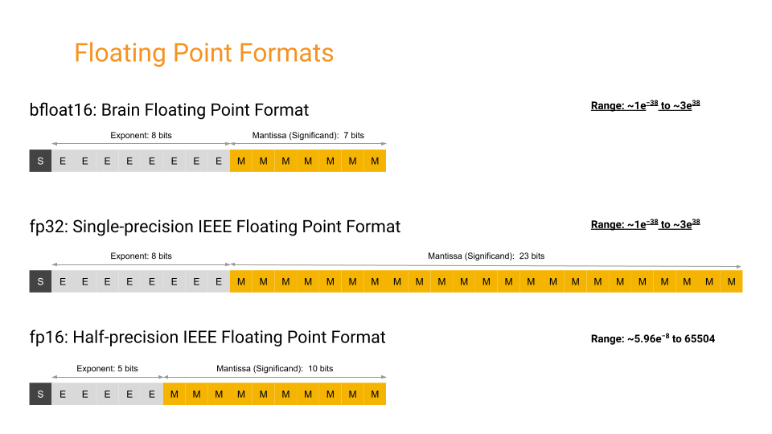

# **7. BFLOAT16 DATA TYPE**

LLaMa 2 Pytorch model file contains tensors stored as 2-byte [BFloat16 (Brain Floating Point)](https://en.wikipedia.org/wiki/Bfloat16_floating-point_format) data type.<br>
The Go language doesn't have neither BFloat16 nor float16 (2-byte floating point) primitive type. Because of this, we need to implement it ourselves. Even it had support for 16-bit floating point (float16), bfloat16 has some differences from standard float16.<br>
At first draft of this project, an 3rd party BFloat16 Go library was used, but because of performance issues, to decrease cycle count, own implementation was done.
>Implementation can be found in [src/dtype/bfloat16.go](../src/dtype/bfloat16.go) file.

## **7.1. Some Notes on the Status Quo of BFloat16 Support in this Project**

Our implementation (and all other Go implementations I've ever seen) only covers conversion between bfloat16 and float32.<br><br>
Because of this, in this project, at the places where mathematical calculations are made using bfloat16, the operations aren't actually performed between two bfloat16 variables. The two bfloat16 values are converted to float32, the mathematical operation is performed between two float32 values, then the resulting float32 value is converted back to bfloat16, via bitwise operations.

Yes, this known issue leads to the consumption of additional CPU cycles that waste time unnecessarily. There's no built-in support for bfloat16 or float16 data types in the Go language. I've attempted to achieve it via CGO, which involves writing C code and then wiring it with Go code. However, the CGO compiler gave an error saying that the CGO compiler doesn't support 2-byte floating points. I haven't yet discovered a viable solution method, but for the time being, this is the status quo.

>The latest Go version at the time of writing this document was 1.21.5. By the time you read this document, support for the Bfloat16 data type may have been added to Go.

## **7.2. Why BFloat16?**

<br>
<sup>Source: [The bfloat16 numerical format](https://cloud.google.com/tpu/docs/bfloat16)</sup>

Decimal numbers are a subset of real numbers with a fractional component.
Floating point is a method in computing to represent these real numbers. In floating-point notation, numbers are composed of three main components: a sign bit, a precision significand (also referred to as fraction or mantissa), and an exponent.

Between variants of floating-point formats, reserved bit counts for exponent and mantissa parts vary as:

* Float32 (single-precision) &nbsp;&nbsp;**Sign:** 1 bit, **Exponent:** 8 bits, **Mantissa:** 23 Bits,
* Float16 (half-precision)&nbsp;&nbsp;&nbsp;&nbsp;&nbsp;&nbsp;&nbsp;**Sign:** 1 bit, **Exponent:** 5 bits, **Mantissa:** 10 Bits,
* BFloat16 (brain-float)&nbsp;&nbsp;&nbsp;&nbsp;&nbsp;&nbsp;&nbsp;&nbsp;&nbsp;&nbsp;**Sign:** 1 bit, **Exponent:** 8 bits, **Mantissa:** 7 Bits

ML applications, particularly neural networks, are sensitive to the size of the exponent than the size of the mantissa for maintaining high precision and accuracy. Let's explore the implications of using different floating-point data types:

* Using larger floating point data type (e.g., float32, float64):
    * Pros: Can be appropriate for high-precision computations,
    * Cons: Requires more storage, additional CPU cycles, and increased I/O throughput.
* Using a smaller floating point data type like float16:
    * Pros: Provides us lightweight storage, reduced CPU consumption, and lower I/O requirement,
    * Cons: Because of lower capacity for the exponent (5 bits instead of 8 bits), it comes up with rounding the original value, especially the fraction part. While this rounding may be tolerated by applications such as large language models and convolutional neural networks, it may deviate the result from the expected output.
* Using another floating point data type which is balanced between others, bfloat16:
    * Pros: Combines the benefits of smaller data types like float16, with the exponent capacity (8 bits) of float32, allowing neural network systems to work more accurately with small numbers without significant losses.
    * Cons: Bfloat16 may lack precision for numbers with larger integral parts. This is not a big problem for our application. Another, built-in support of CPUs and accelerator devices is limited, although it is gradually emerging. Alternative workarounds can be applied in absence of native support, as demonstrated in this project.

>This is the engineering world. Engineering is the art of tackling between tradeoffs :)

## **7.3. Representing a Number as Floating Point**

To represent a number in floating point method, we can walk through the example in [How to Convert a Number from Decimal to IEEE 754 Floating Point Representation](https://www.wikihow.com/Convert-a-Number-from-Decimal-to-IEEE-754-Floating-Point-Representation), some of following sentences were taken from this source. But the original example number overflows the BFloat 16, I didn't want to dive into the details of how to deal with it, so I changed it to a smaller number. Also, BFloat16 is mostly used with significantly small numbers like 0.0000012345, to keep this document simple, 5.125 was chosen as an example.

* Goal is to write a human-readable, base 10 number as scientific notation in base 2 as:

$$
\pm \text{significand} \times \text{base}^{\text{exponent}}
$$

* Our example in base 10:

$$
\begin{gathered}
\text{human-readable, base 10}\\
5.125_{10}
\end{gathered}
$$

* Our example in base 2:

$$
\begin{gathered}
\text{converted to binary, base 2} \\
101.001_{2}
\end{gathered}
$$

* Wrote in scientific notation:

$$
\begin{gathered}
\text{normalized(scientific notation)} \\
1.01001\times 2^2
\end{gathered}
$$

* Determine the sign: this number is positive. The sign bit is 0 for positive and 1 for negative numbers. Ours is 0 *(record it)*.

* There are set biases for half, single, and double precisions. The exponent bias for BFloat16 is 127, which means we must add the base 2 exponent found previously to it. Thus, the exponent we will use is 127+2 equals 129.
    > Note: The **exponent bias** concept (for BFloat16, it is 127) is used in floating-point representation to allow storing both positive and negative exponents in a fixed number of bits (for BFloat16, it is 8 bits).

* Convert our exponent value 129 to base 2: 10000001 *(record it)*.

* Determine the significand/mantissa: Significand/mantissa is the rest of the number after the decimal of the base 2 scientific notation. We'll just drop the leading 1 in the front and copy the decimal portion of the number: Drop the 1 from 1.01001 -> 01001, to align it to 7-bit slots, we will pad the right of the bits with 0 *(record it).

$$
\begin{array}{|c|c|c|c|}
\hline
    \text{index}
    &0
    &\begin{array}{c|c|c|c|c|c|c|c} 0 &1 &2 &3 & 4& 5 &6 &7 \end{array}
    &
    \begin{array}{c|c|c|c|c|c|c} 0 &1 &2 &3 & 4& 5 &6 \end{array} \\
\hline
    \text{bits}
    &0
    &\begin{array}{c|c|c|c|c|c|c|c} 1 &0 &0 & 0& 0& 0 &0 &1 \end{array}
    &
    \begin{array}{c|c|c|c|c|c|c} 0 &1 &0 &0 &1 &0 &0 \end{array} \\
\hline
\text{part} &\text{Sign} &\text{Exponent (8 bit)} &\text{Mantissa (7 bit)} \\
\hline
\end{array}
$$

* When this bit sequence is realigned into byte layout, we will have ```b0``` and ```b1``` bytes with bits ```0-7``` and ```8-15```.

$$
\begin{array}{|c|l|c|c|c|c|c|c|c|c|l|c|c|c|c|c|c|c|c|}
\hline
    \text{index} &\text{b0} &0 &1 &2 &3 &4 &5 &6 &7 &\text{b1} &8 &9 &10 &11 &12 &13 &14 &15 \\
\hline
    \text{bits} &\text{b0} &0 &1 &0 &0 &0 &0 &0 &0 &\text{b1} &1 &0 &1 &0 &0 &1 &0 &0 \\
\hline
\end{array}
$$

* At the end, will have two bytes: ```b0 = 01000000``` and ```b1 = 10100100```. Because we mostly use Little Endian, we swap two bytes while creating the byte array.

Let's cross-check the correctness of our calculation with this Go code, using our definitions in [src/dtype/bfloat16.go](../src/dtype/bfloat16.go):

```go
b0 := byte(0b01000000)
b1 := byte(0b10100100)
byteArr := []byte{b1, b0}
bfloat16Val := dtype.BFloat16frombits(binary.LittleEndian.Uint16(byteArr))
float32Val := bfloat16Val.Float32()
fmt.Printf("b0: binary: 0b%08b, hex: 0x%X, decimal: %d\n", b0, b0, b0)
fmt.Printf("b1: binary: 0b%08b, hex: 0x%X, decimal: %d\n", b1, b1, b1)
    fmt.Printf("little endian uint16 representation: binary: 0b%016b, hex: 0x%X, decimal: %d\n", bfloat16Val, bfloat16Val, bfloat16Val)
fmt.Printf("float32 value: %g\n", float32Val)
```

This code prints out following output:

```sh
b0: binary: 0b01000000, hex: 0x40, decimal: 64
b1: binary: 0b10100100, hex: 0xA4, decimal: 164
little endian uint16 representation: binary: 0b0100000010100100, hex: 0x40A4, decimal: 16548
float32 value: 5.125
```

See for more information:

* [Floating-point arithmetic - Wikipedia](https://en.wikipedia.org/wiki/Floating-point_arithmetic)
* [To Bfloat or not to Bfloat? That is the Question!](https://www.cerebras.net/machine-learning/to-bfloat-or-not-to-bfloat-that-is-the-question)
* [The bfloat16 numerical format](https://cloud.google.com/tpu/docs/bfloat16)
* [How to Convert a Number from Decimal to IEEE 754 Floating Point Representation](https://www.wikihow.com/Convert-a-Number-from-Decimal-to-IEEE-754-Floating-Point-Representation)

<br>

---

<div align="right">

[&lt;&nbsp;&nbsp;Previous chapter: LOADING TOKENIZER MODEL \(DETAILS\)](./06-LOADING-TOKENIZER-MODEL-DETAILS.md)&nbsp;&nbsp;&nbsp;&nbsp;&nbsp;&nbsp;|&nbsp;&nbsp;&nbsp;&nbsp;&nbsp;&nbsp;[Next chapter: TENSOR&nbsp;&nbsp;&gt;](./08-TENSOR.md)

</div>
