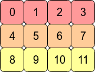
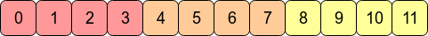

# **8. TENSOR**

In mathematics and computer science, [tensors](https://en.wikipedia.org/wiki/Tensor_%28machine_learning%29) are fundamental structures to represent multi-dimensional arrays of numbers. Tensors are generalized form of scalars, vectors, and matrices, which have higher dimensions. Tensors are widely used in fields like mathematics, physics, engineering, computer graphics, and machine learning.

Quantitive magnitudes without any direction are called [scalars](https://en.wikipedia.org/wiki/Scalar_%28mathematics%29), quantities having a magnitude and a direction, represented by one-dimensional arrays are called [vectors](https://en.wikipedia.org/wiki/Vector), and objects with two-dimensions, arranged in rows and columns are called [matrices](https://en.wikipedia.org/wiki/Matrix_%28mathematics%29) are tensors.

The number of dimensions in which the object is expressed is called *degree of the tensor*. While scalars, vectors, and matrices have degrees of zero, one, and two, respectively, tensors can have degree of three or higher.

>Source: [Tensor - Wikipedia (Turkish)](https://tr.wikipedia.org/wiki/Tens%C3%B6r) | [Tensor (machine learning)
](https://en.wikipedia.org/wiki/Tensor_%28machine_learning%29)

## **8.1. Introduction to Tensors**

After making theoretical and mathematical definitions and pointing out the differences between these concepts, we can dive into the programmatical details of a tensor.

In machine learning, all of these concepts of scalars (e.g., integers, floating points, complex numbers), vectors, matrices, and tensors are widely used to store numbers and perform mathematical operations between them.

While implementing the tensor concept, we must design it as generalized as our project requires. Not much, not less, because the goal of our project is not to be a production-level tensor framework.

## **8.2. Properties of a Tensor Type**

A tensor type should have at least the following features:

* **Data type:**

    In the simplest approach, e.g., we could have defined a ```[][][]float``` 3D array of floats hardcoded for storage of numbers. However, this approach comes with limitations of having fixed dimensions and hardcoded data types. This approach wouldn't allow us to store our numbers as BFloat16 or complex numbers.

    To support multiple data types, we could have used generics by defining a struct as ```Tensor[T any]```. I had tried to do this, but limitations of generics features of Go placed roadblocks on my path, like "methods of a struct can't have generic type parameters". I'm not sure if I could or couldn't succeed with this issue using another programming language that I'm already familiar with, such as C#, Java, or one of the others.

    But... The flexibility comes with the hard way, "having a type-agnostic data storage": ```[]byte``` array. The details will be explained following bullet.

    To make it flexible, the tensor type has a "data type" variable: [Tensor.DataType](../src/ml/tensor.go). The "raw data" is read and written according to this data type specification.

    This data type can be one of following:

    * [DT_BF16](../src/ml/datatype.go)
    * [DT_F32](../src/ml/datatype.go)
    * [DT_UINT16](../src/ml/datatype.go)
    * [DT_INT32](../src/ml/datatype.go)
    * [DT_COMPLEX](../src/ml/datatype.go)

* **Raw data variable:**

    We pointed out that data is stored in ```[]byte``` array. [Tensor.RawData](../src/ml/tensor.go) is a byte array.

    Our Tensor type implementation stores the array always in [C contiguous](https://stackoverflow.com/questions/26998223/what-is-the-difference-between-contiguous-and-non-contiguous-arrays) form.

    Existing battle-tested tensor frameworks support both contiguous and non-contiguous forms, because of providing some features like Transpose. Our project has a Transpose method for Tensor type, but it creates a new tensor with realigned bytes, so in our case, all bytes are relocated physically, not virtually. So, our tensors are always in contiguous form.

    It can be visually explained, consider the 2D array (matrix) with shape [4, 3], it looks like as follows:

    <br>
<sup>Source: [What is the difference between contiguous and non-contiguous arrays?](https://stackoverflow.com/questions/26998223/what-is-the-difference-between-contiguous-and-non-contiguous-arrays)</sup>

    In the computer's memory (our [Tensor.RawData](../src/ml/tensor.go) ```[]byte``` array), the values of this matrix are stored as follows:

    <br>
<sup>Source: [What is the difference between contiguous and non-contiguous arrays?](https://stackoverflow.com/questions/26998223/what-is-the-difference-between-contiguous-and-non-contiguous-arrays)</sup>

    So, for e.g., we can address the element at row=1, col=2 as ```contiguous item index = 1 * row size + 2 = 1 * 4 + 2 = 6```, we accessed to the value, it is 6.

    Here, we multiplied the "row size" with "row index", and we jumped to the starting address of the target row. We call this multiplier "row size" as "stride".

    The address calculation above was done on "item index as address". Assume our tensor's data type is ```DT_BF16``` (BFloat16) which has item size of 2 bytes. If we want to calculate pointer address of the item 6, we need to do this calculation: ```contiguous item byte address = (1 * row size + 2) * 2 = (1 * 4 + 2) * 2 = 12```. Our item is stored in bytes 12nd and 13rd in the byte array.

    This calculation is done in this project with following method. ByteStride is precalculated using the tensor's Size when a tensor was created or a tensor's shape is changed:

    <sup>from [src/ml/tensor.go](../src/ml/tensor.go)</sup>

    ```go
    func (t *Tensor) calculateByteOffset(loc []int) int {
        offset := 0
        for i := 0; i < len(loc); i++ {
            offset += loc[i] * t.ByteStride[i]
        }
        return offset
    }
    ```

    In some places this ```calculateByteOffset``` method is used directly, in other places (the places using unsafe memory access) the starting pointer address is calculated with this metohd, then local offsets is added to the base pointer address.

* **Shape (Size):**

    In Python world, it is called as "Shape", I saw in C world "Size" word is used for same aim. Because as I told in [0. THE JOURNEY](./00-THE-JOURNEY.md), I've started to the project with exploring the [llama.cpp](https://github.com/ggerganov/llama.cpp) project. [llama.cpp](https://github.com/ggerganov/llama.cpp) uses "Size" word in its terminology, I've used "Size" too, then I didn't changed further.

    Thanks to the all data is stored as contiguous ```[]byte``` array, it doesn't matter we reshape a tensor with shape ```[4, 3]``` to ```[3, 4]```. Or the same is correct for ```[32, 128]``` to ```[32, 8, 16]```. While this reshaping operation, the raw data isn't changed physically, only the Size property of the tensor is changed. Reshaping operation has some constraints, like total item count can't be different between old shape and new shape.

## **8.3. Accessing to Elements**

While using Tensor type, there are three ways to access (read or write) elements:

* **Method 1:** *(Calling a function)* Accessing with byte offset integer, index of starting byte of the item (```int```) in the raw data ```[]byte``` array, as a general datatype ```any```, it is a **safe** method,
* **Method 2:** *(Calling a function)* Accessing with human-readable location, with a multi-dimensional array of item indices (```[]int```), called "location", as a general datatype ```any```, it is a **safe** method,
* **Method 3:** *(Calling a function)* Accessing with pointer address of starting byte of the item (```unsafe.Pointer```) in the ```[]byte``` array, it is an **unsafe** method.
* **Method 4:** *(Inline code, without calling a function)* Accessing with pointer address of starting byte of the item (```unsafe.Pointer```) in the ```[]byte``` array, it is an **unsafe** method.

The **safe** methods, the first two mentioned above *(Method 1 and 2)*, are under the control of Go, thus you won't encounter a memory access error. However, in the case of the last two methods *(Method 3 and 4)*, which are **unsafe**, it's your code's responsibility to ensure that the accessed memory address via ```unsafe.Pointer``` is properly allocated and available for access. Otherwise, the [Garbage Collector of Go](https://tip.golang.org/doc/gc-guide) might have freed the memory address before you attempt to access it.

In addition to these advantages of *(Method 1 and 2)*, the performance of these  **safe** methods is relatively low, especially in case they are called millions of times in a row. Because each of them recalculates the offset and pointer location internally at each of time they called. Also, in our project, these methods take or return ```any``` type to provie flexibility. Using ```any``` type adds extra overheads like:

* Storing the type variable of the variable internally alongside the value, which requires extra storage,
* Requirement of type assertion (```valInt, ok := val.(float32)```) or type switch (```switch val := val.(type) {...}```) before using real value, this also leads to the consumption of additional CPU cycles that waste time unnecessarily.

Alongside these issues, the last two **unsafe** methods *(Method 3 and 4)*, are faster than **safe** methods. Especially *Method 4* doesn't call another function at a different memory location,  it is the fastest way, but it is the hardest one for code reading and maintainability.

>Performance issues caused by calling another function (which hurts performance for millions of calls) can be avoided by using [inline functions](https://www.geeksforgeeks.org/inline-functions-cpp/). Go compiler itself decides inlining conditions, there isn't any directive to say compiler to use it as inline, you can check if a function is called inline or not, via go pprof tool.
>
>See: [Is it possible to inline function, containing loop in Golang?](https://stackoverflow.com/questions/45836981/is-it-possible-to-inline-function-containing-loop-in-golang)

## **8.4. Methods: Calculation of Locations**

Because of we store our values in C contiguous form, we need to do some calculations to find the physical address of an element.

* **calculateByteStride:**

```calculateByteStride``` is called explicitly when creating a new tensor with function family of ```NewTensor```, or implicitly when calling ```Tensor.Reshape```.

It precalculates the ```byte stride``` of the new tensor while creating.

>See (note that, stride concept in Pytorch means the unit of element count, in our project, it means byte count):
>
>* [TORCH.TENSOR.STRIDE](https://pytorch.org/docs/stable/generated/torch.Tensor.stride.html)
>* [Explain Pytorch Tensor.stride and Tensor.storage with code examples](https://zhang-yang.medium.com/explain-pytorch-tensor-stride-and-tensor-storage-with-code-examples-50e637f1076d)

<sup>from [src/ml/tensor.go](../src/ml/tensor.go)</sup>

```go
func NewTensor(name string, size []int, stride []int, dataType DataType, RawData []byte) *Tensor {
    return &Tensor{
        Name:       name,
        Size:       size,
        Stride:     stride,
        DataType:   dataType,
        RawData:    RawData,
        ByteStride: calculateByteStride(size, dataType),
    }
}
```

**Example usage:**

```go
tensorSize := []int{128256, 4096}
tensorDataType := DT_BF16
tensorByteStride := calculateByteStride(tensorSize, tensorDataType)
```

```tensorByteStride``` will output ```[]int{8192, 2}```.

Because, think of our tensor is a matrix with *row count=128256*, *column count=4096*:

* Element index of the first element of our *Row 0* is 0. Elements are at indices between 0 and 4095. Address of it the first element is 0.
* Element index of the first element of our *Row 1* is "column count of a row": 4096. Elements are at indices between 4096 and 8191. Address of it the first element is ```4096 * item byte size of BFloat16 = 4096 * 2 = 8192```.

Our the byte stride of 0th dimension (distance between two rows) is 8192, the byte stride of 1st dimension (distance between two columns) is 2 (byte size of one BFloat16). So, our byte stride array will be ```[]int{8192, 2}```.

<sup>from [src/ml/tensor.go](../src/ml/tensor.go)</sup>

```go
func calculateByteStride(size []int, dataType DataType) []int {
    if len(size) == 0 {
        return []int{1}
    }
    result := make([]int, len(size))

    result[len(size)-1] = dataType.ItemSize
    for i := len(size) - 2; i >= 0; i-- {
        result[i] = result[i+1] * size[i+1]
    }
    return result
}
```

* **Tensor.calculateByteOffset:**

```Tensor.calculateByteOffset``` calculates the byte offset of given multi-dimensional array location, using byte strides of the tensor.

**Example usage:**

Think of we have a tensor with:

* Size: ```[]int {8192, 64}```
* DataType: ```DT_BF16 (BFloat16)```
* ByteStride: ```[]int {128, 2}```

And, you want to know the byte offset of the element at human-readable location ```[]int{3, 19}```. Row index=3, column index=19.

The ```calculateByteOffset([]int{3, 19})``` call will calculate ```(3 * 128) + (19 * 2) = 422```. This means, the BFloat16 value at the location of ```[]int{3, 19}``` is stored at 422nd and 423rd bytes of the tensor raw data byte array.

<sup>from [src/ml/tensor.go](../src/ml/tensor.go)</sup>

```go
func (t *Tensor) calculateByteOffset(loc []int) int {
    offset := 0
    for i := 0; i < len(loc); i++ {
        offset += loc[i] * t.ByteStride[i]
    }
    return offset
}
```

## **8.5. Methods: Access Methods**

### **8.5.1. Access Methods Taking Offset, Using Any Type**

The following methods accept the offset of the raw data byte array and retrieve or modify values as any. However, performance might be affected due to the necessity of using type assertion or type switch operations.

```go
func (t *Tensor) GetItemByOffset(offset int) any
func (t *Tensor) SetItemByOffset(offset int, val any) error
```

### **8.5.2. Access Methods Taking Offset, Using Float32**

The following methods accept the offset of the raw data byte array and retrieve or modify values as Float32. However, performance might be affected due to the necessity of conversion between original data type (specified at ```Tensor.DataType```) and ```float32```.

```go
func (t *Tensor) GetItemByOffset_AsFloat32(offset int) (float32, error)
func (t *Tensor) SetItemByOffset_FromFloat32(offset int, val float32) error
```

### **8.5.3. Access Methods Taking Location, Using Any Type**

The following methods accept the human-readable location, with a multi-dimensional array of item indices and retrieve or modify values as any. However, performance might be affected due to the necessity of using type assertion or type switch operations alongside the calculation of byte offset by specified ```loc []int```.

```go
func (t *Tensor) GetItem(loc []int) (any, error)
func (t *Tensor) SetItem(loc []int, val any) error
```

### **8.5.4. Access Methods Taking Location, Using Float32**

The following methods accept the human-readable location, with a multi-dimensional array of item indices and retrieve or modify values as Float32. However, performance might be affected due to the necessity of conversion between original data type (specified at ```Tensor.DataType```) and ```float32``` alongside the calculation of byte offset by specified ```loc []int```.

```go
func (t *Tensor) GetItem_AsFloat32(loc []int) (float32, error)
func (t *Tensor) SetItem_FromFloat32(loc []int, val float32) error
```

### **8.5.5. Accessing Directly Items with Unsafe**

Samples can be found in [src/ml/operations_lineartransform.go](../src/ml/operations_lineartransform.go) and [src/ml/operations_matmul.go](../src/ml/operations_matmul.go) because these operations are highly CPU-intensive, we need to prevent any possible extra performance overhead, even calling a different function that couldn't be inlined by the compiler.

> These type of unsafe operations must be done correctly and carefully. It is suggested **not to use** unsafe methods in general.

```go
// Sample 1:
val1F32 := dtype.BFloat16bitsToFloat32((*(*uint16)(unsafe.Add(inputRowPtr, wInIdx*inputItemSize))))
// Sample 2:
*(*float32)(unsafe.Add(dstRawLocalPtr, dstValInRow.itemOffsetInRow)) = dstValInRow.val
```

<br>

---

<div align="right">

[&lt;&nbsp;&nbsp;Previous chapter: BFLOAT16 DATA TYPE](./07-BFLOAT16-DATA-TYPE.md)&nbsp;&nbsp;&nbsp;&nbsp;&nbsp;&nbsp;|&nbsp;&nbsp;&nbsp;&nbsp;&nbsp;&nbsp;[Next chapter: IMPLEMENTING LLAMA MODEL ARCHITECTURE&nbsp;&nbsp;&gt;](./09-IMPLEMENTING-LLAMA-MODEL-ARCHITECTURE.md)

</div>
