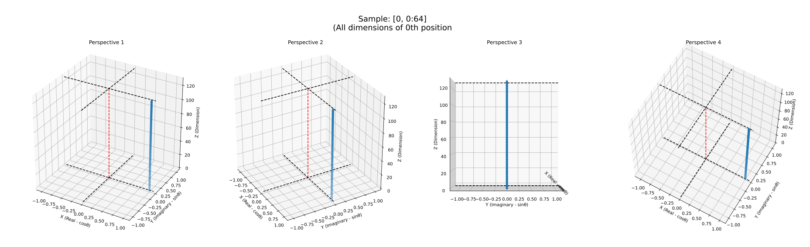
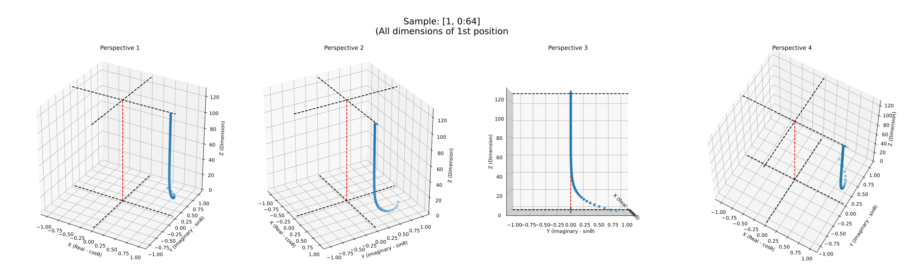
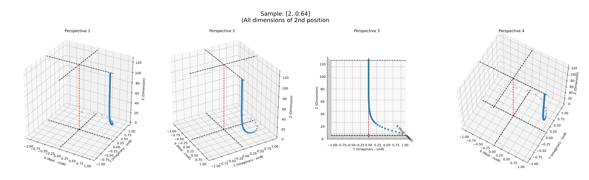
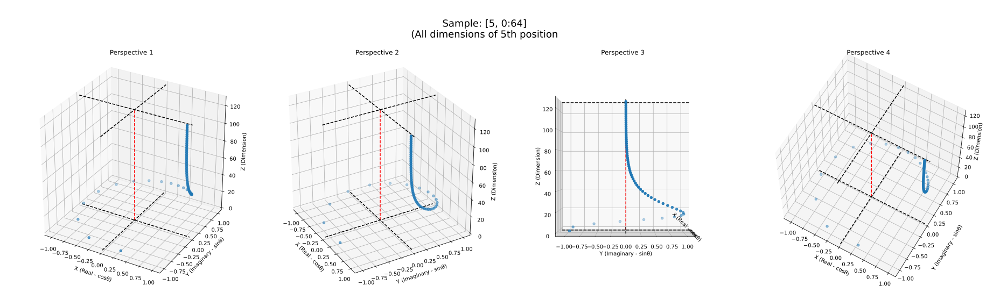
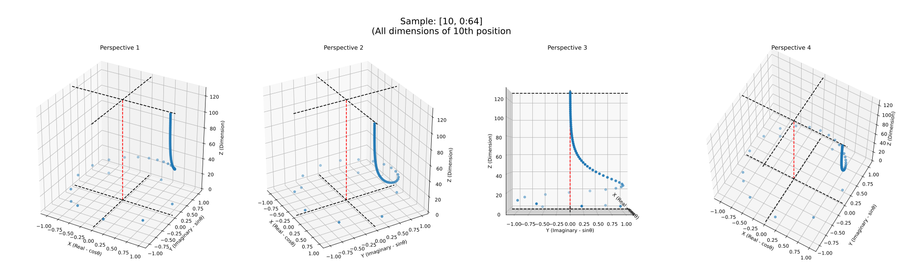
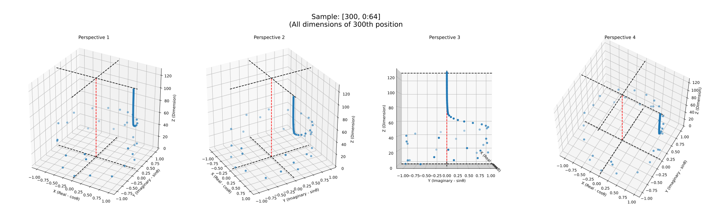
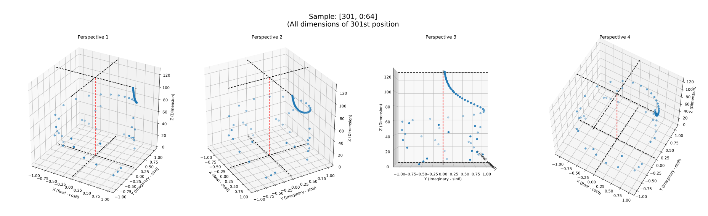
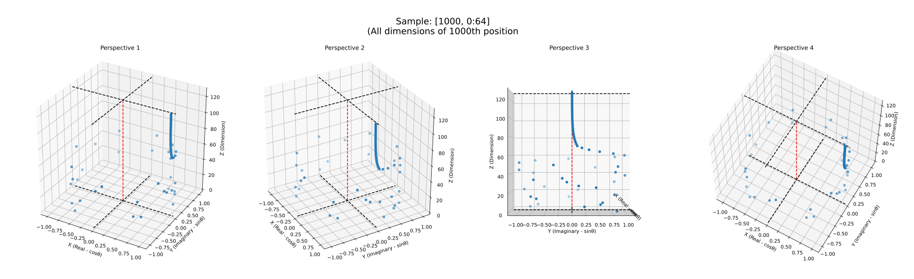
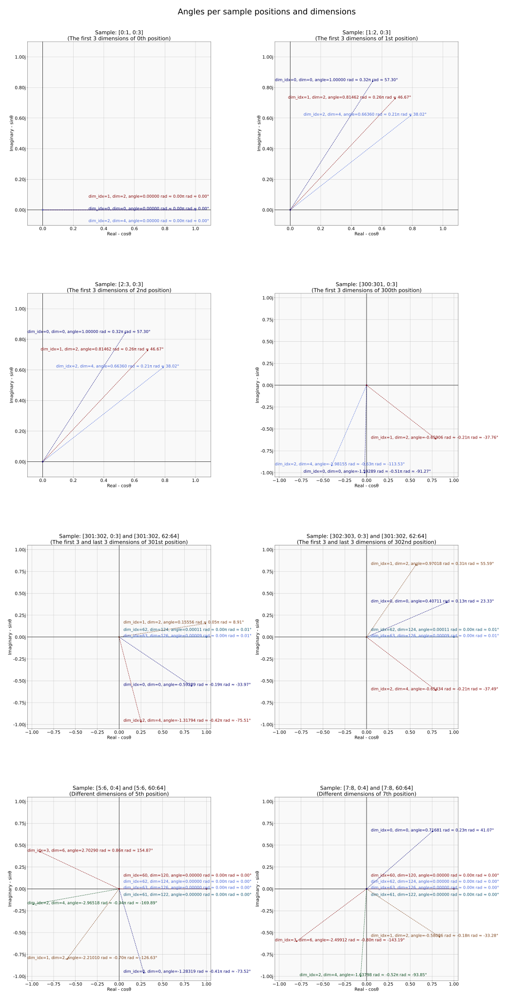

# **10. RoPE (ROTARY POSITIONAL EMBEDDINGS)**

The LLaMa model uses RoPE (Rotary Positional Embeddings) alongside the standard embedding layer to highlight the influence of token positions within a sequence.

For decades, *embedding* has been the most commonly used technique to represent words, concepts, or tokens in NLP (Natural Language Processing) world. Typically, an embedding model is trained to let them learn frequencies of use of tokens together. The tokens are placed in suitable positions within a multi-dimensional space, where distances reflect the difference or similarity between them.

There are a wide variety of different methods to implement embeddings. Some of them take token positions into account.

Taking the token positions into account is important. Think of, two sentences containing exactly the same words in different orders. If you don't take the positions into account, your system handles these two sentences (despite with different meanings) as the same thing.

## **10.1. Preliminary Concepts**

Let's try to explain with an example. Think of, we have a sequence of 5 tokens and an embedding layer with the shape of ```{32000, 4096}```. So, we have:

* A token embedding sequence which was calculated using the embedding layer. Our input tensor will be with the shape of ```{5, 4096}```,
* We have ```32``` "attention heads" (according to ```modelArgs.N_Heads = 32```). Our each attention head will have a dimension ```modelArgs.Dim / modelArgs.N_Heads```. In our case, it is ```4096 / 32 = 128```. So our positional embedding tensors will have ```128``` dimensions.
* We have an array of position indices of the tokens: ```{1, 2, 3, 4, 5}```.

We have several alternatives to calculate the positional embeddings. Some of them are:

* Taking the positions as they are: ```{0, 1, 2, 3, 4}```,
* Taking the positions in normalized values between ```0``` and ```1``` as ```{0., 0.25, 0.50, 0.75, 1.}```,
* As suggested in the paper [Attention Is All You Need](https://arxiv.org/abs/1706.03762), using sinusoidal functions. Each dimension of the positional encoding corresponds to a sinusoid:

    $$
    \begin{gathered}
        PE_(pos,2i) = \sin(pos/10000^\frac{2i}{d_{model}}) \\
        PE_(pos,2i+1) = \cos(pos/10000^\frac{2i}{d_{model}})
    \end{gathered}
    $$

    This means that, we have ```128``` dimensions for each position, ```i``` will loop from ```0``` to ```64``` (half of ```128```). Our ```PE``` positional embedding array for ```3th``` position will be like:

    $$
    \begin{gathered}
        PE = \left\lbrace
        \begin{array}{l}
        \sin\left(\frac{3}{10000^\frac{0}{128}}\right),
        \cos\left(\frac{3}{10000^\frac{0}{128}}\right),
        \sin\left(\frac{3}{10000^\frac{2}{128}}\right),
        \cos\left(\frac{3}{10000^\frac{2}{128}}\right), \\
        \dots, \\
        \sin\left(\frac{3}{10000^\frac{124}{128}}\right),
        \cos\left(\frac{3}{10000^\frac{124}{128}}\right),
        \sin\left(\frac{3}{10000^\frac{126}{128}}\right),
        \cos\left(\frac{3}{10000^\frac{126}{128}}\right)
        \end{array}
        \right\rbrace \\
    \end{gathered}
    $$

* As suggested in the paper [RoFormer](https://arxiv.org/abs/2104.09864v5), using sinusoidal functions in slightly different ways, as described following parts,
* Using the output of a custom function that takes the position indices as input.

We have several alternatives to integrate the positional embeddings with the token embedding vectors. If our positional embedding vectors and the token embedding vectors both have same dimension, we can sum or multiply them:

* Summation: As suggested in the paper [Attention Is All You Need](https://arxiv.org/abs/1706.03762) too, we can simply add two vectors as ```new_embeddings = token_embeddings + positional_embeddings```,
* Multiplication: As suggested in the paper [RoFormer](https://arxiv.org/abs/2104.09864v5) too, we can simply multiply element-wise two vectors as ```new_embeddings = token_embeddings * positional_embeddings```.

Think of, we can take the positions as they are, ```{0, 1, 2, 3, 4}```, and add them with each dimension of our embedding vectors. It may work, but sounds not so much meaningful, right? So, we need to find a more meaningful method.

You can find some introduction for *absolute position embedding* and *relative position embedding* in the paper [RoFormer](https://arxiv.org/abs/2104.09864v5) alongside the proposed approach *RoPE (Rotary Positional Embeddings)* by the same paper.

The main idea behind these approaches is to let the model effectively take into account token positions. *RoPE (Rotary Positional Embeddings)* approach represents the positions of tokens in the polar coordinate system, which employs angles and complex numbers.

With this approach, we have a chance to combine multiple approaches and we have the following advantages:

* To distribute our positional embeddings in the space in a limited range (```[-1, +1]``` because of limits of ```cos``` and ```sin``` functions),
* Other approaches prefer summation to integrate the positional embeddings with the token embedding vectors. However, the summation corrupts the exact data that the vector has. But in this approach, we prefer multiplication. And the value we multiply is a sinusoidal function, a sinusoid, we can think that we are only ***rotating*** the original embedding vector by an angle. So, theoretically, we don't corrupt the original data,
* In the approach of [RoFormer](https://arxiv.org/abs/2104.09864v5) that we used in this project, takes the items of ```128``` dimension of an attention head as ```64``` pairs. Then, it obtains a complex number from each pair by taking the first item of the pair as *real part* and the second item of the pair as *imaginary part* of a complex number.

$$
\begin{gathered}
    \text{where }i^2=-1, i\text{ is the imaginary unit,} \\
    out = abs \cdot \cos(angle) + abs \cdot \sin(angle) \cdot i
\end{gathered}
$$

* Taking the items of an attention head as float pairs and representing them as complex numbers in polar coordinate system makes our method more suitable for its mathematical nature. Also, this allows it to represent these complex numbers as a matrix, which allows us to perform matrix operations.
* With this approach, the influence of position on embeddings is high for lower dimensions (going from the first dimension throughout 128 dimensions) and converges to zero for higher dimensions. This makes higher dimensions of embeddings less sensitive to positional data than lower dimensions. Because the polar coordinates calculated for higher dimensions are nearly the same value.
    >**Important note:** I read it in a few sources then I saw it with the 3D charts that I drew in the notebook [10.BONUS-PRECOMPUTING-FREQUENCY-TENSOR.ipynb](./10.BONUS-PRECOMPUTING-FREQUENCY-TENSOR.ipynb), also can be found the bottom of this chapter.

>Note: In this approach, some concepts from computing, mathematics, geometry, and physics were combined. For example, we can think that:
>
> * Our positions are points in a time series,
> * Our positional encoding function as *a function with respect to time*, so we can say it is a signal,
> * Our angles as *angular frequency* (${\displaystyle \omega }$) and our positions as *real independent variable/time* of a sine wave.

In the following subchapters, we will see how these polar coordinates are precalculated. These values don't vary by input, so this calculation is made only once.

Sources:

* [A Guide on Word Embeddings in NLP](https://www.turing.com/kb/guide-on-word-embeddings-in-nlp)
* [Word Embeddings in Natural Language Processing(NLP)](https://www.theaidream.com/post/word-embeddings-in-natural-language-processing-nlp)
* [RoFormer: Enhanced Transformer with Rotary Position Embedding Paper](https://arxiv.org/abs/2104.09864v5)
* [Youtube - RoPE (Rotary positional embeddings) explained: The positional workhorse of modern LLMs](https://www.youtube.com/watch?v=GQPOtyITy54)
* [Youtube - LLaMA explained... - "Rotary Positional Embeddings" section](https://www.youtube.com/watch?v=Mn_9W1nCFLo&t=1471s)

## **10.2. Introduction to Precomputing The Frequency Tensor**

>You can check out the following for more information:
>
> * The Python codes that create the sample data and graphs used here with this Python Notebook: [10.BONUS-PRECOMPUTING-FREQUENCY-TENSOR.ipynb](./10.BONUS-PRECOMPUTING-FREQUENCY-TENSOR.ipynb).
> * [A Gentle Introduction to Positional Encoding in Transformer Models, Part 1](https://machinelearningmastery.com/a-gentle-introduction-to-positional-encoding-in-transformer-models-part-1/) article.

The [precomputeFreqsCis(...)](../src/model/llamatransformer.go) function takes two arguments: ```dim``` and ```end```.

The argument ```dim``` is computed as ```int(modelArgs.Dim/modelArgs.N_Heads)```, ```end``` is computed as ```modelArgs.MaxSequenceLength*2```. In our case, ```dim = 4096/32 = 128```,  ```end = 4096 * 2 = 8192```.

In our case, the [precomputeFreqsCis(...)](../src/model/llamatransformer.go) function is called with ```dim = 128``` and ```end = 8192```.

<sup>from [src/model/llamatransformer.go](../src/model/llamatransformer.go)</sup>

```go
func NewLlamaTransformer(model *Model) (*LlamaTransformer, error) {
    result := &LlamaTransformer{}
    ...
    if result.PrecomputedFreqsCis, err = precomputeFreqsCis(int(dim/modelArgs.N_Heads), modelArgs.MaxSequenceLength*2); err != nil {
        return nil, err
    }
    ...
}
```

## **10.3. Initiating Angles of Frequency Tensor**

In the [original LLaMa 2 Python repository of Meta](https://github.com/facebookresearch/llama/blob/ef351e9cd9496c579bf9f2bb036ef11bdc5ca3d2/llama/model.py#L80), this Python code initiates the ```freqs``` array:

```py
import torch

def precompute_freqs_cis(dim: int, end: int, theta: float = 10000.0):
    ...
    freqs = 1.0 / (theta ** (torch.arange(0, dim, 2)[: (dim // 2)].float() / dim))
    ...
```

>**Important note:** The ```theta``` variables in both Go and Python code are not an angle. They are explained as: *"Scaling factor for frequency computation. Defaults to 10000.0."*.<br>
>Instead, the ```freqs``` is an array of angles, that corresponds to $\Theta$ and each item of ```freqs``` array corresponds to $\theta_i$ below.<br>
>Personally, at first sight, I was confused why they called *scaling factor* as ```theta``` which is a term that made me think *it is an angle*, but it isn't, items of the ```freqs``` are in an angle unit (radians), but at the end, they are only premise value (scaling factor) for the real angles!

The original equation in section "3.2.2 General form" of [RoFormer: Enhanced Transformer with Rotary Position Embedding](https://arxiv.org/abs/2104.09864):

$$
\begin{gathered}
\Theta = \left\lbrace \theta_i = 10000^{-\frac{2(i - 1)}{dim}}, i \in [1, 2, \dots, \frac{dim}{2}] \right\rbrace
\end{gathered}
$$

If we expand it for ```dim=128``` in our case:

$$
\begin{gathered}
\Theta = \left\lbrace
  \theta_1 = 10000^{-\frac{2(1 - 1)}{128}},
  \theta_2 = 10000^{-\frac{2(2 - 1)}{128}},
  \theta_3 = 10000^{-\frac{2(3 - 1)}{128}},
  \dots,
  \theta_{63} = 10000^{-\frac{2(63 - 1)}{128}},
  \theta_{64} = 10000^{-\frac{2(64 - 1)}{128}}
\right\rbrace \\
= \\
\Theta = \left\lbrace
  \theta_1 = 10000^{-\frac{0}{128}},
  \theta_2 = 10000^{-\frac{2}{128}},
  \theta_3 = 10000^{-\frac{4}{128}},
  \dots,
  \theta_{63} = 10000^{-\frac{124}{128}},
  \theta_{64} = 10000^{-\frac{126}{128}}
\right\rbrace \\
= \\
\Theta = \left\lbrace
  \theta_1 = \frac{1}{10000^{\frac{0}{128}}},
  \theta_2 = \frac{1}{10000^{\frac{2}{128}}},
  \theta_3 = \frac{1}{10000^{\frac{4}{128}}},
  \dots,
  \theta_{63} = \frac{1}{10000^{\frac{124}{128}}},
  \theta_{64} = \frac{1}{10000^{\frac{126}{128}}}
\right\rbrace
\end{gathered}
$$

If it will be expressed with variable names in the code:

$$
\begin{gathered}
freqs =
\left\lbrace
    \text{item}_{i} = \frac{1}{theta^{\frac{val}{dim}}}
\right\rbrace
, val \in \lbrack0, 2, 4, ...,dim - 2\rbrack
, i \in \left[0, 1, 2, ..., \frac{dim}{2} -1\right] \\
\\
\\
\text{freqs} =
\left\lbrace
    \text{item}_0 = \frac{1}{10000^{\frac{0}{128}}},
    \text{item}_1 = \frac{1}{10000^{\frac{2}{128}}},
    \text{item}_2 = \frac{1}{10000^{\frac{4}{128}}},
    \dots,
    \text{item} _{62} = \frac{1}{10000^{\frac{124}{128}}},
    \text{item} _{63} = \frac{1}{10000^{\frac{126}{128}}}
\right\rbrace
\end{gathered}
$$

<sup>from [src/model/llamatransformer.go](../src/model/llamatransformer.go)</sup>

```go
func precomputeFreqsCis(dim int, end int) (*ml.Tensor, error) {
    ...
    dimFloat := float32(dim)
    freqs, err := ml.ARange(0, dim, 2, ml.DT_BF16)
    ...
    err = freqs.Apply_AsFloat32(func(val float32) float32 {
        return float32(1.0 / math.Pow(theta, float64(val/dimFloat)))
    })
    ...
}
```

Go project (ours) values of the ```freqs``` array:

```yaml
freqs: {0, 2, 4, 6, 8, 10, 12, ..., 124, 126} # has 64 items, at this time, the freqs array contains "val" values that exists in the equations above.
# after running Apply_AsFloat32, freqs will be:
freqs: { # has 64 items, in radians.
    1.0000e+00, 8.6328e-01, 7.4609e-01, 6.4844e-01, 5.5859e-01, 4.8633e-01,
    4.1992e-01, 3.6328e-01, 3.1445e-01, 2.7344e-01, 2.3633e-01, 2.0508e-01,
    1.7773e-01, 1.5332e-01, 1.3281e-01, 1.1523e-01, 9.9609e-02, 8.6426e-02,
    7.4707e-02, 6.4453e-02, 5.6152e-02, 4.8584e-02, 4.1992e-02, 3.6377e-02,
    3.1494e-02, 2.7344e-02, 2.3682e-02, 2.0508e-02, 1.7700e-02, 1.5381e-02,
    1.3306e-02, 1.1536e-02, 9.9487e-03, 8.6060e-03, 7.4768e-03, 6.4697e-03,
    5.6152e-03, 4.8523e-03, 4.2114e-03, 3.6469e-03, 3.1586e-03, 2.7313e-03,
    2.3651e-03, 2.0447e-03, 1.7776e-03, 1.5335e-03, 1.3275e-03, 1.1520e-03,
    9.9945e-04, 8.6594e-04, 7.4768e-04, 6.4850e-04, 5.6076e-04, 4.8637e-04,
    4.2152e-04, 3.6430e-04, 3.1471e-04, 2.7275e-04, 2.3651e-04, 2.0504e-04,
    1.7738e-04, 1.5354e-04, 1.3256e-04, 1.1539e-04
}
```

This is the output of Python + Pytorch environment. There are slight differences between them because of floating point precision differences.

In the table below, you can find approximate equivalents of radian angle values in degrees, with corresponding "val" indices:

| **val** | rad     | deg   |     | **val** | rad     | deg   |     | **val** | rad     | deg   |     | **val** | rad     | deg   |
|:-------:|--------:|------:|-----|:-------:|--------:|------:|-----|:-------:|--------:|------:|-----|:-------:|--------:|------:|
| **0**   | 1.00000 | 57.296|     | **32**  | 0.10000 | 5.730 |     | **64**  | 0.01000 | 0.573 |     | **96**  | 0.00100 | 0.057 |
| **2**   | 0.86596 | 49.616|     | **34**  | 0.08660 | 4.962 |     | **66**  | 0.00866 | 0.496 |     | **98**  | 0.00087 | 0.050 |
| **4**   | 0.74989 | 42.966|     | **36**  | 0.07499 | 4.297 |     | **68**  | 0.00750 | 0.430 |     | **100** | 0.00075 | 0.043 |
| **6**   | 0.64938 | 37.207|     | **38**  | 0.06494 | 3.721 |     | **70**  | 0.00649 | 0.372 |     | **102** | 0.00065 | 0.037 |
| **8**   | 0.56234 | 32.220|     | **40**  | 0.05623 | 3.222 |     | **72**  | 0.00562 | 0.322 |     | **104** | 0.00056 | 0.032 |
| **10**  | 0.48697 | 27.901|     | **42**  | 0.04870 | 2.790 |     | **74**  | 0.00487 | 0.279 |     | **106** | 0.00049 | 0.028 |
| **12**  | 0.42170 | 24.161|     | **44**  | 0.04217 | 2.416 |     | **76**  | 0.00422 | 0.242 |     | **108** | 0.00042 | 0.209 |
| **14**  | 0.36517 | 20.923|     | **46**  | 0.03652 | 2.092 |     | **78**  | 0.00365 | 0.209 |     | **110** | 0.00037 | 0.021 |
| **16**  | 0.31623 | 18.119|     | **48**  | 0.03162 | 1.812 |     | **80**  | 0.00316 | 0.181 |     | **112** | 0.00032 | 0.018 |
| **18**  | 0.27384 | 15.690|     | **50**  | 0.02738 | 1.569 |     | **82**  | 0.00274 | 0.157 |     | **114** | 0.00027 | 0.016 |
| **20**  | 0.23714 | 13.587|     | **52**  | 0.02371 | 1.359 |     | **84**  | 0.00237 | 0.136 |     | **116** | 0.00024 | 0.014 |
| **22**  | 0.20535 | 11.766|     | **54**  | 0.02054 | 1.177 |     | **86**  | 0.00205 | 0.118 |     | **118** | 0.00021 | 0.012 |
| **24**  | 0.17783 | 10.189|     | **56**  | 0.01778 | 1.019 |     | **88**  | 0.00178 | 0.102 |     | **120** | 0.00018 | 0.010 |
| **26**  | 0.15399 | 8.823 |     | **58**  | 0.01540 | 0.882 |     | **90**  | 0.00154 | 0.088 |     | **122** | 0.00015 | 0.009 |
| **28**  | 0.13335 | 7.641 |     | **60**  | 0.01334 | 0.764 |     | **92**  | 0.00133 | 0.076 |     | **124** | 0.00013 | 0.008 |
| **30**  | 0.11548 | 6.616 |     | **62**  | 0.01155 | 0.662 |     | **94**  | 0.00115 | 0.066 |     | **126** | 0.00012 | 0.007 |

Sources:

* RoFormer: Enhanced Transformer with Rotary Position Embedding: [Paper](https://arxiv.org/abs/2104.09864v5) | [Papers with Code](https://paperswithcode.com/paper/roformer-enhanced-transformer-with-rotary) | [LabML Annotated Implementation](https://nn.labml.ai/transformers/rope/index.html)
* Llama 2: Open Foundation and Fine-Tuned Chat Models
: [Paper](https://arxiv.org/abs/2307.09288)
* LLaMA: Open and Efficient Foundation Language Models
: [Paper](https://arxiv.org/abs/2302.13971v1)

## **10.4. Getting Outer Product of Frequency Tensor and Position Indices**

```py
import torch

def precompute_freqs_cis(dim: int, end: int, theta: float = 10000.0):
    ...
    t = torch.arange(end, device=freqs.device)  # type: ignore
    freqs = torch.outer(t, freqs).float()  # type: ignore
    ...
```

<sup>from [src/model/llamatransformer.go](../src/model/llamatransformer.go)</sup>

```go
func precomputeFreqsCis(dim int, end int) (*ml.Tensor, error) {
    ...
    t, err := ml.ARange(0, end, 1, ml.DT_BF16)
    if err != nil {
        return nil, err
    }
    ...
}
```

The ```end``` is computed as ```modelArgs.MaxSequenceLength*2```. In our case, ```end = 4096 * 2 = 8192```.

> :warning: Note for weirdnes here: In original implementation, ```modelArgs.MaxSequenceLength``` value is equal to ```512``` which is limitation for input prompt token count. With multiplying to 2, they've aimed to avoid of unnecessary calculations.<br>
> However, in our implementation, we specified ```modelArgs.MaxSequenceLength``` as ```4096```, and when we multiply it with 2, we get ```8192```, an unnecessary and unmeaningful value. But I left it as it is, it doesn't hurt correctness, it causes only calculating unused unnecessary values.<br>
> We will continue with 8192, but know that, it is unnecessarily high.<br>
> On this issue, the original Python code has a comment:<br>

```py
# Note that self.params.max_seq_len is multiplied by 2 because the token limit for the Llama 2 generation of models is 4096. 
# Adding this multiplier instead of using 4096 directly allows for dynamism of token lengths while training or fine-tuning.```
```

At first, we generate a tensor named ```t``` with 8192 items as: ```{0, 1, 2, 3, ..., 8189, 8190, 8191}```. This tensor contains our position indices.

<sup>from [src/model/llamatransformer.go](../src/model/llamatransformer.go)</sup>

```go
func precomputeFreqsCis(dim int, end int) (*ml.Tensor, error) {
    ...
    freqs, err = ml.Outer(t, freqs)
    if err != nil {
        return nil, err
    }
    ...
}
```

By calling [ml.Outer(t, freqs)](../src/ml/operations_impl.go) function, a tensor with shape ```{8192, 64}``` which is outer product of tensors ```t with shape {8192}```and ```freqs with shape {64}```.

This "outer product" function takes first argument as row vectors, second argument as column vectors.

In our case, we take items of ```t``` as rows, items of ```freqs``` as columns, then create 2D tensor called ```result``` as follows:

| row                  | column                        | set the result as                                       | python equivalent (rad) | python equivalent (deg)           |
|:---------------------|:------------------------------|:--------------------------------------------------------|-------------------------|-----------------------------------|
| ```t[0] = 0```       | ```freqs[0] = 1.0000e+00```   | ```result[0][0] = 0 * 1.0000e+00 = 0```                 | 0.00000                 | 0.000                             |
|                      | ```freqs[1] = 8.6328e-01```   | ```result[0][1] = 0 * 8.6328e-01 = 0```                 | 0.00                    | 0.000                             |
| ...                  |                               |                                                         |                         |                                   |
| ```t[1] = 1```       | ```freqs[0] = 1.0000e+00```   | ```result[1][0] = 1 * 1.0000e+00 = 1.0000e+00```        | 1.00000                 | 57.296                            |
|                      |  ```freqs[1] = 8.6328e-01```  | ```result[1][1] = 1 * 8.6328e-01 = 8.6328e-01```        | 0.86596                 | 49.616                            |
|                      | ...                           |                                                         |                         |                                   |
|                      | ```freqs[62] = 1.3256e-04```  | ```result[1][62] = 1 * 1.3256e-04 = 1.3256e-04```       | 0.00013                 | 0.008                             |
|                      | ```freqs[63] = 1.1539e-04```  | ```result[1][63] = 1 * 1.1539e-04 = 1.1539e-04```       | 0.00012                 | 0.007                             |
| ...                  |                               |                                                         |                         |                                   |
| ```t[2] = 2```       | ```freqs[0] = 1.0000e+00```   | ```result[2][0] = 2 * 1.0000e+00 = 2.0000e+00```        | 2.00000                 | 114.592                           |
|                      | ```freqs[1] = 8.6328e-01```   | ```result[2][1] = 2 * 8.6328e-01 = 1.7266e+00```        | 1.73193                 | 99.232                            |
|                      | ...                           |                                                         |                         |                                   |
|                      | ```freqs[62] = 1.3256e-04```  | ```result[2][62] = 2 * 1.3256e-04 = 2.6512e-04```       | 0.00027                 | 0.015                             |
|                      | ```freqs[63] = 1.1539e-04```  | ```result[2][63] = 2 * 1.1539e-04 = 2.3079e-04```       | 0.00023                 | 0.013                             |
| ...                  |                               |                                                         |                         |                                   |
| ```t[8190] = 8190``` | ```freqs[0] = 1.0000e+00```   | ```result[8190][0] = 8190 * 1.0000e+00 = 8.1600e+03```  | 8190.00000              | 469252.406 (normalized: 172.406)  |
|                      |  ```freqs[1] = 8.6328e-01```  | ```result[8190][1] = 8190 * 8.6328e-01 = 7.0400e+03```  | 7092.24805              | 406355.844 (normalized: -84.156)  |
|                      | ...                           |                                                         |                         |                                   |
|                      | ```freqs[62] = 1.3256e-04```  | ```result[8190][62] = 8190 * 1.3256e-04 = 1.0781e+00``` | 1.09215                 | 62.576                            |
|                      |  ```freqs[63] = 1.1539e-04``` | ```result[8190][63] = 8190 * 1.1539e-04 = 9.4141e-01``` | 0.94577                 | 54.188                            |
| ...                  |                               |                                                         |                         |                                   |
| ```t[8191] = 8191``` |  ```freqs[0] = 1.0000e+00```  | ```result[8191][0] = 8191 * 1.0000e+00 = 8.1600e+03```  | 8191.00000              | 469309.719 (normalized: -130.281) |
|                      | ```freqs[1] = 8.6328e-01```   | ```result[8191][1] = 8191 * 8.6328e-01 = 7.0400e+03```  | 7093.11426              | 406405.500 (normalized: -34.500)  |
|                      | ...                           |                                                         |                         |                                   |
|                      | ```freqs[62] = 1.3256e-04```  | ```result[8191][62] = 8191 * 1.3256e-04 = 1.0781e+00``` | 1.09229                 | 62.583                            |
|                      | ```freqs[63] = 1.1539e-04```  | ```result[8191][63] = 8191 * 1.1539e-04 = 9.4141e-01``` | 0.94588                 | 54.195                            |
|                      | ...                           |                                                         |                         |                                   |

<sup>from [src/ml/operations_impl.go](../src/ml/operations_impl.go)</sup>

```go
func Outer(vec1 *Tensor, vec2 *Tensor) (*Tensor, error) {
    if err := processErrors(
        checkIsVector(vec1),
        checkIsVector(vec2),
        checkSameDataType(vec1, vec2),
    ); err != nil {
        return nil, err
    }
    itemSize := vec1.DataType.ItemSize
    result := NewEmptyTensor([]int{vec1.Size[0], vec2.Size[0]}, vec1.DataType)
    for i := 0; i < vec1.Size[0]; i++ {
        rowValF32, err := vec1.GetItemByOffset_AsFloat32(i * itemSize)
        if err != nil {
            return nil, err
        }
        for j := 0; j < vec2.Size[0]; j++ {
            colValF32, err := vec2.GetItemByOffset_AsFloat32(j * itemSize)
            if err != nil {
                return nil, err
            }
            valF32 := rowValF32 * colValF32
            if err := result.SetItem_FromFloat32([]int{i, j}, valF32); err != nil {
                return nil, err
            }
        }
    }
    return result, nil
}
```

## **10.5. Calculating Frequency Tensor as Cis (Polar Coordinates)**

[cis](https://en.wikipedia.org/wiki/Cis_%28mathematics%29) is described at Wikipedia:

>cis is a mathematical notation defined by cis x = cos x + i sin x,[nb 1] where cos is the cosine function, i is the imaginary unit and sin is the sine function. x is the argument of the complex number (angle between line to point and x-axis in polar form).

$$
\begin{gathered}
\text{where }i^2=-1, i\text{ is the imaginary unit,} \\
cis x = cos x + i \cdot sin x
\end{gathered}
$$

With this notation, we can express a point's location in cartesian coordinate system with cosine and sine of one angle, which is called as [polar coordinates](https://en.wikipedia.org/wiki/Polar_coordinate_system).

We've calculated angles of our polar coordinate points as ```freqs``` in previous chapter.

```py
import torch

def precompute_freqs_cis(dim: int, end: int, theta: float = 10000.0):
    ...
    freqs_cis = torch.polar(torch.ones_like(freqs), freqs)  # complex64
    return freqs_cis
```

<sup>from [src/model/llamatransformer.go](../src/model/llamatransformer.go)</sup>

```go
func precomputeFreqsCis(dim int, end int) (*ml.Tensor, error) {
    ...
    ones, err := ml.OnesLike(freqs)
    if err != nil {
        return nil, err
    }
    freqs_cis, err := ml.Polar(ones, freqs)
    if err != nil {
        return nil, err
    }
    return freqs_cis, nil
}
```

We create a tensor which contains all ```1``` values with same shape ```{8192, 64}``` and data type as ```freqs``` tensor, via [ml.OnesLike(...))](../src/ml/operations_impl.go). These  ```1``` values will be the magnitude of our vector in polar coordinate system. We use 1 for magnitude to get identity vector for the angle.

By calling [ml.Polar(ones, freqs)](../src/ml/operations_impl.go) function, a tensor with shape ```{8192, 64}``` which is outer product of tensors ```t with shape {8192}```and ```freqs with shape {64}``` is got.

[Polar function](https://pytorch.org/docs/stable/generated/torch.polar.html) is described at Pytorch TORCH.POLAR documentation:

>Constructs a complex tensor whose elements are Cartesian coordinates corresponding to the polar coordinates with absolute value abs and angle.

$$
\begin{gathered}
\text{where }i^2=-1, i\text{ is the imaginary unit,} \\
out = abs \cdot \cos(angle) + abs \cdot \sin(angle) \cdot i
\end{gathered}
$$

In our case, the ```abs``` argument is a tensor full of ```1``` values. ```angle``` argument is our ```freqs``` variable.

For each item in the ```angle``` tensor:

* The cosine value of the angle is got, multiplied by ```absItemF64 = 1``` (it is always 1 in our case), set as the *real* part of the resulting complex number,
* The sine value of the angle is got, multiplied by ```absItemF64 = 1``` (it is always 1 in our case), set as the *imaginary* part of the resulting complex number.

Then, the ```dst``` tensor with ```DT_COMPLEX``` data type has cosine and sine values of our angles as complex numbers.

<sup>from [src/ml/operations_impl.go](../src/ml/operations_impl.go)</sup>

```go
func Polar(abs *Tensor, angle *Tensor) (*Tensor, error) {
    // See: (For formula) https://pytorch.org/docs/stable/generated/torch.polar.html
    ...
    for readOffset := 0; readOffset < abs.GetBytesCount(); readOffset += absItemSize {
        absItemF32, err := abs.GetItemByOffset_AsFloat32(readOffset)
        if err != nil {
            return nil, err
        }
        angleItemF32, err := angle.GetItemByOffset_AsFloat32(readOffset)
        if err != nil {
            return nil, err
        }

        absItemF64 := float64(absItemF32)
        angleItemF64 := float64(angleItemF32)

        realPart := absItemF64 * math.Cos(angleItemF64)
        imagPart := absItemF64 * math.Sin(angleItemF64)
        resultItem := complex64(complex(realPart, imagPart))
        if err := dst.SetItemByOffset(writeOffset, resultItem); err != nil {
            return nil, err
        }
        writeOffset += dstItemSize
    }
    return dst, nil
}
```

In our case, with ```1``` is always as ```absItemF64```:

| angleItemF64                       | realPart                           | imagPart                          | resultItem                |
|:-----------------------------------|:-----------------------------------|:----------------------------------|:--------------------------|
| ```freqs[0][0] = 0```              | ```cos(0) = 1```                   | ```sin(0) = 0```                  | (1 + 0i)                  |
| ```freqs[0][1] = 0```              | ```cos(0) = 1```                   | ```sin(0) = 0```                  | (1 + 0i)                  |
| ...                                |                                    |                                   |                           |
| ```freqs[1][0] = 1```              | ```cos(1) = 0.5403023```           | ```sin(1) = 0.84147096```         | (0.5403023 + 0.84147096i) |
| ...                                |                                    |                                   |                           |
| ```freqs[8191][63] = 0.94140625``` | ```cos(0.94140625) = 0.58865184``` | ```sin(0.94140625) = 0.8083867``` | (0.58865184 + 0.8083867i) |

## **10.6. The result**

Recap of what we have so far:

* An embedding layer with the shape of ```{32000, 4096}```, that contains vectors that have ```4096``` dimensions each, ```32000``` different token vectors.
* A token embedding sequence which was calculated using the embedding layer. Our input tensor will be with the shape of ```{SequenceLength, 4096}```,
* We have ```32``` "attention heads" (according to ```modelArgs.N_Heads = 32```). Our each attention head will have a dimension ```modelArgs.Dim / modelArgs.N_Heads```. In our case, it is ```4096 / 32 = 128```. So our positional embedding tensors will have ```128``` dimensions.
* Because of we have ```32``` attention heads and the dimesion of our each attention head is ```128```, we will separate our ```xq (queries)``` and ```xk (keys)``` matrices into 32 equal pieces that end up with ```128``` at one dimension. Then, the integration with positional embeddings and the token embeddings is done on ```128``` dimension.
* Think of, we have 5 tokens to encode, so we have position indices of the tokens: ```{1, 2, 3, 4, 5}```.

After all of these processes, we will end up with a "positional encoding tensor" for a sequence having ```5``` positions as follows:

>Note: The $\LaTeX$ support of Github web app lacks and gives non-explanatory errors when you have more than a limit of superscipts/subscripts/fraction notations. So, it was a must to separate the biggest set notation into chunks.

$$
PE = \left\lbrace
\begin{array}{l}
p_{pos,2i} = \sin\left(pos \cdot \frac{1}{10000^\frac{2i}{d_{model}}}\right) \\
\\
p_{pos,2i+1} = \cos\left(pos \cdot \frac{1}{10000^\frac{2i}{d_{model}}}\right) \\
\end{array}
\right\rbrace
$$

* Positional Encoding tensor for 5 positions, without converting to complex number:

$$
\begin{gathered}
\text{where }PE_{pos,i} \in \mathbb{R}^{dim = 128}, \\
\\
PE = \left\lbrack
\begin{array}{l}
    PE_{pos0}, PE_{pos1}, PE_{pos2}, PE_{pos3}, PE_{pos4}
\end{array}
\right\rbrack
\end{gathered}
$$

<br>

$$
\begin{gathered}
    PE_{pos0}=
    \left\lbrace
    \begin{array}{l}
        \sin\left(\frac{0}{10000^{\frac{0}{128}}}\right),
        \cos\left(\frac{0}{10000^{\frac{0}{128}}}\right),
        \sin\left(\frac{0}{10000^{\frac{2}{128}}}\right),
        \cos\left(\frac{0}{10000^{\frac{2}{128}}}\right),
        \sin\left(\frac{0}{10000^{\frac{4}{128}}}\right),
        \cos\left(\frac{0}{10000^{\frac{4}{128}}}\right),
        \dots, \\\\
        \sin\left(\frac{0}{10000^{\frac{124}{128}}}\right),
        \cos\left(\frac{0}{10000^{\frac{124}{128}}}\right),
        \sin\left(\frac{0}{10000^{\frac{126}{128}}}\right),
        \cos\left(\frac{0}{10000^{\frac{126}{128}}}\right)
    \end{array}
    \right\rbrace \\
\end{gathered}
$$

$$
\begin{gathered}
    PE_{pos1}=
    \left\lbrace
    \begin{array}{l}
        \sin\left(\frac{1}{10000^{\frac{0}{128}}}\right),
        \cos\left(\frac{1}{10000^{\frac{0}{128}}}\right),
        \sin\left(\frac{1}{10000^{\frac{2}{128}}}\right),
        \cos\left(\frac{1}{10000^{\frac{2}{128}}}\right),
        \sin\left(\frac{1}{10000^{\frac{4}{128}}}\right),
        \cos\left(\frac{1}{10000^{\frac{4}{128}}}\right),
        \dots, \\\\
        \sin\left(\frac{1}{10000^{\frac{124}{128}}}\right),
        \cos\left(\frac{1}{10000^{\frac{124}{128}}}\right),
        \sin\left(\frac{1}{10000^{\frac{126}{128}}}\right),
        \cos\left(\frac{1}{10000^{\frac{126}{128}}}\right)
    \end{array}
    \right\rbrace \\
\end{gathered}
$$

$$
\begin{gathered}
    PE_{pos2}=
    \left\lbrace
    \begin{array}{l}
        \sin\left(\frac{2}{10000^{\frac{0}{128}}}\right),
        \cos\left(\frac{2}{10000^{\frac{0}{128}}}\right),
        \sin\left(\frac{2}{10000^{\frac{2}{128}}}\right),
        \cos\left(\frac{2}{10000^{\frac{2}{128}}}\right),
        \sin\left(\frac{2}{10000^{\frac{4}{128}}}\right),
        \cos\left(\frac{2}{10000^{\frac{4}{128}}}\right),
        \dots, \\\\
        \sin\left(\frac{2}{10000^{\frac{124}{128}}}\right),
        \cos\left(\frac{2}{10000^{\frac{124}{128}}}\right),
        \sin\left(\frac{2}{10000^{\frac{126}{128}}}\right),
        \cos\left(\frac{2}{10000^{\frac{126}{128}}}\right)
    \end{array}
    \right\rbrace \\
\end{gathered}
$$

$$
\begin{gathered}
    PE_{pos3}=
    \left\lbrace
    \begin{array}{l}
        \sin\left(\frac{3}{10000^{\frac{0}{128}}}\right),
        \cos\left(\frac{3}{10000^{\frac{0}{128}}}\right),
        \sin\left(\frac{3}{10000^{\frac{2}{128}}}\right),
        \cos\left(\frac{3}{10000^{\frac{2}{128}}}\right),
        \sin\left(\frac{3}{10000^{\frac{4}{128}}}\right),
        \cos\left(\frac{3}{10000^{\frac{4}{128}}}\right),
        \dots, \\\\
        \sin\left(\frac{3}{10000^{\frac{124}{128}}}\right),
        \cos\left(\frac{3}{10000^{\frac{124}{128}}}\right),
        \sin\left(\frac{3}{10000^{\frac{126}{128}}}\right),
        \cos\left(\frac{3}{10000^{\frac{126}{128}}}\right)
    \end{array}
    \right\rbrace \\
\end{gathered}
$$

$$
\begin{gathered}
    PE_{pos4}=
    \left\lbrace
    \begin{array}{l}
        \sin\left(\frac{4}{10000^{\frac{0}{128}}}\right),
        \cos\left(\frac{4}{10000^{\frac{0}{128}}}\right),
        \sin\left(\frac{4}{10000^{\frac{2}{128}}}\right),
        \cos\left(\frac{4}{10000^{\frac{2}{128}}}\right),
        \sin\left(\frac{4}{10000^{\frac{4}{128}}}\right),
        \cos\left(\frac{4}{10000^{\frac{4}{128}}}\right),
        \dots, \\\\
        \sin\left(\frac{4}{10000^{\frac{124}{128}}}\right),
        \cos\left(\frac{4}{10000^{\frac{124}{128}}}\right),
        \sin\left(\frac{4}{10000^{\frac{126}{128}}}\right),
        \cos\left(\frac{4}{10000^{\frac{126}{128}}}\right)
    \end{array}
    \right\rbrace \\
\end{gathered}
$$

<br><br>

* Positional Encoding tensor for 5 positions, after converting to complex number:

$$
\begin{gathered}
\text{where }PE_{pos,i} \in \mathbb{C}^{\frac{dim}{2} = 64}, i^2=-1, i\text{ is the imaginary unit,}
\\
\\
PE = \left\lbrack
\begin{array}{l}
    PE_{pos0}, PE_{pos1}, PE_{pos2}, PE_{pos3}, PE_{pos4}
\end{array}
\right\rbrack
\end{gathered}
$$

<br>

$$
\begin{gathered}
    PE_{pos0}=
    \left\lbrace
    \begin{array}{l}
        \sin\left(\frac{0}{10000^{\frac{0}{128}}}\right) + i \cos\left(\frac{0}{10000^{\frac{0}{128}}}\right),
        \sin\left(\frac{0}{10000^{\frac{2}{128}}}\right) + i \cos\left(\frac{0}{10000^{\frac{2}{128}}}\right),
        \sin\left(\frac{0}{10000^{\frac{4}{128}}}\right) + i \cos\left(\frac{0}{10000^{\frac{4}{128}}}\right),
        \dots, \\\\
        \sin\left(\frac{0}{10000^{\frac{124}{128}}}\right) + i \cos\left(\frac{0}{10000^{\frac{124}{128}}}\right),
        \sin\left(\frac{0}{10000^{\frac{126}{128}}}\right) + i \cos\left(\frac{0}{10000^{\frac{126}{128}}}\right)
    \end{array}
    \right\rbrace \\
\end{gathered} \\\\
$$

$$
\begin{gathered}
    PE_{pos1}=
    \left\lbrace
    \begin{array}{l}
        \sin\left(\frac{1}{10000^{\frac{0}{128}}}\right) + i \cos\left(\frac{1}{10000^{\frac{0}{128}}}\right),
        \sin\left(\frac{1}{10000^{\frac{2}{128}}}\right) + i \cos\left(\frac{1}{10000^{\frac{2}{128}}}\right),
        \sin\left(\frac{1}{10000^{\frac{4}{128}}}\right) + i \cos\left(\frac{1}{10000^{\frac{4}{128}}}\right),
        \dots, \\\\
        \sin\left(\frac{1}{10000^{\frac{124}{128}}}\right) + i \cos\left(\frac{1}{10000^{\frac{124}{128}}}\right),
        \sin\left(\frac{1}{10000^{\frac{126}{128}}}\right) + i \cos\left(\frac{1}{10000^{\frac{126}{128}}}\right)
    \end{array}
    \right\rbrace \\\\
\end{gathered} \\
$$

$$
\begin{gathered}
    PE_{pos2}=
    \left\lbrace
    \begin{array}{l}
        \sin\left(\frac{2}{10000^{\frac{0}{128}}}\right) + i \cos\left(\frac{2}{10000^{\frac{0}{128}}}\right),
        \sin\left(\frac{2}{10000^{\frac{2}{128}}}\right) + i \cos\left(\frac{2}{10000^{\frac{2}{128}}}\right),
        \sin\left(\frac{2}{10000^{\frac{4}{128}}}\right) + i \cos\left(\frac{2}{10000^{\frac{4}{128}}}\right),
        \dots, \\\\
        \sin\left(\frac{2}{10000^{\frac{124}{128}}}\right) + i \cos\left(\frac{2}{10000^{\frac{124}{128}}}\right),
        \sin\left(\frac{2}{10000^{\frac{126}{128}}}\right) + i \cos\left(\frac{2}{10000^{\frac{126}{128}}}\right)
    \end{array}
    \right\rbrace \\\\
\end{gathered} \\
$$

$$
\begin{gathered}
    PE_{pos3}=
    \left\lbrace
    \begin{array}{l}
        \sin\left(\frac{3}{10000^{\frac{0}{128}}}\right) + i \cos\left(\frac{3}{10000^{\frac{0}{128}}}\right),
        \sin\left(\frac{3}{10000^{\frac{2}{128}}}\right) + i \cos\left(\frac{3}{10000^{\frac{2}{128}}}\right),
        \sin\left(\frac{3}{10000^{\frac{4}{128}}}\right) + i \cos\left(\frac{3}{10000^{\frac{4}{128}}}\right),
        \dots, \\\\
        \sin\left(\frac{3}{10000^{\frac{124}{128}}}\right) + i \cos\left(\frac{3}{10000^{\frac{124}{128}}}\right),
        \sin\left(\frac{3}{10000^{\frac{126}{128}}}\right) + i \cos\left(\frac{3}{10000^{\frac{126}{128}}}\right)
    \end{array}
    \right\rbrace \\
\end{gathered} \\\\
$$

$$
\begin{gathered}
    PE_{pos4}=
    \left\lbrace
    \begin{array}{l}
        \sin\left(\frac{4}{10000^{\frac{0}{128}}}\right) + i \cos\left(\frac{4}{10000^{\frac{0}{128}}}\right),
        \sin\left(\frac{4}{10000^{\frac{2}{128}}}\right) + i \cos\left(\frac{4}{10000^{\frac{2}{128}}}\right),
        \sin\left(\frac{4}{10000^{\frac{4}{128}}}\right) + i \cos\left(\frac{4}{10000^{\frac{4}{128}}}\right),
        \dots, \\\\
        \sin\left(\frac{4}{10000^{\frac{124}{128}}}\right) + i \cos\left(\frac{4}{10000^{\frac{124}{128}}}\right),
        \sin\left(\frac{4}{10000^{\frac{126}{128}}}\right) + i \cos\left(\frac{4}{10000^{\frac{126}{128}}}\right)
    \end{array}
    \right\rbrace \\
\end{gathered} \\
$$

## **10.7. Visualized Form of Some Samples from The Frequency Tensor**

The charts below aim to give you some insight into the values of angles and corresponding polar coordinates in the frequency tensor. The chart titles contain which index ranges are taken as samples in a particular chart.

These charts are drawn to make it easy for you to compare changes between positions and dimensions.

>You can check out the Python codes that create the sample data and charts used here with this Python Notebook: [10.BONUS-PRECOMPUTING-FREQUENCY-TENSOR.ipynb](./10.BONUS-PRECOMPUTING-FREQUENCY-TENSOR.ipynb)

3D charts of polar coordinates:










2D charts of angles:



<br>

---

<div align="right">

[&lt;&nbsp;&nbsp;Previous chapter: IMPLEMENTING LLAMA MODEL ARCHITECTURE](./09-IMPLEMENTING-LLAMA-MODEL-ARCHITECTURE.md)&nbsp;&nbsp;&nbsp;&nbsp;&nbsp;&nbsp;|&nbsp;&nbsp;&nbsp;&nbsp;&nbsp;&nbsp;[Next chapter: ASKING FOR USER INPUT&nbsp;&nbsp;&gt;](./11-ASKING-FOR-USER-INPUT.md)

</div>
